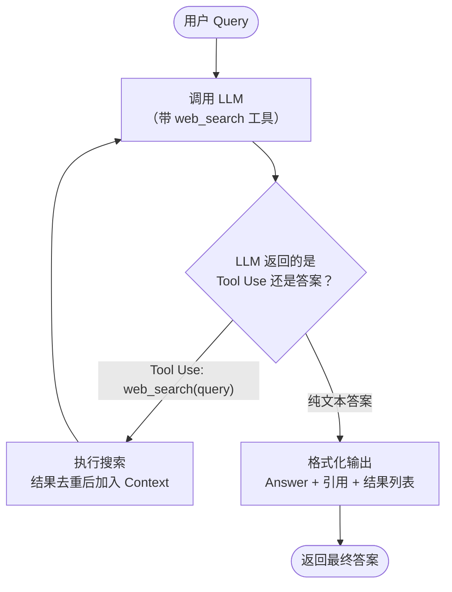

+++
date = '2026-06-22T10:00:00-07:00'
draft = false
title = 'Agentic AI Search 原理和代码: 极简演示'
+++

传统的 RAG 搜索里，LLM 是个**被动的读者**：先固定搜一次，把结果一股脑喂给 LLM，让它合成一个答案。LLM 不参与"该怎么搜"。

**Agentic AI Search** 把 LLM 变成主动的 **Orchestrator**（指挥者）。它自己决定：

- 搜**什么** query
- 要不要**再搜**一次（换个 query）
- 什么时候信息**够了**，可以直接作答

举两个直观例子：

- 问 "1 + 2" —— LLM 直接回答 "3"，根本不触发搜索。
- 问 "Claude Code 是怎么实现的？" —— LLM 自己发起了两次不同 query 的搜索，攒够信息后才作答。

这就是从 RAG 到 **Agentic AI Search** 的转变，也是现代 AI 聊天与搜索引擎背后的核心范式。下面用 ~120 行 Python 把它从零讲清楚。

## 一、原理：Agent Loop + Tool Use

整个机制就是一个循环：给 LLM 一个 `web_search` 工具，让它在循环里自己决定**搜**还是**答**。



几个关键点：

1. **工具**：LLM 拿到一个 `web_search` 工具，用 JSON schema 描述。
2. **每轮二选一**：要么调工具去搜（结果加进 context，继续循环），要么返回纯文本答案（退出循环）。
3. **去重**：跨多次搜索的结果按 URL 去重，每个 URL 只出现一次，并分配一个全局编号 `[n]`。
4. **`MAX_LOOP_TIMES`**：循环上限（默认 3），防止 Agent 反复搜索却永远不肯作答。

## 二、完整代码

整个程序就一个 Python 文件，约 124 行：

```python
import os, json, sys
import litellm
from tavily import TavilyClient

# --- API Keys ----------------------------------------------------------------
TAVILY_API_KEY = "tvly-..."  # your Tavily API key
OPENAI_API_KEY = "sk-..."    # your OpenAI API key
os.environ["OPENAI_API_KEY"] = OPENAI_API_KEY

# --- Configuration -----------------------------------------------------------
MODEL          = "gpt-4o-mini"  # change to e.g. "gpt-4o", "claude-3-5-haiku-20241022"
TOP_K          = 10             # max web results per search
MAX_LOOP_TIMES = 3              # max LLM calls per request (including final answer)

litellm.set_verbose = False


# --- Step 1: Web Search Tool -------------------------------------------------

def search_web(query, k=TOP_K):
    """Return top-k Tavily results for query."""
    response = TavilyClient(api_key=TAVILY_API_KEY).search(query, max_results=k)
    return response["results"]  # each: {title, url, content, score}


WEB_SEARCH_TOOL = {
    "type": "function",
    "function": {
        "name": "web_search",
        "description": "Search the web for current information on a topic.",
        "parameters": {
            "type": "object",
            "properties": {
                "query": {"type": "string", "description": "The search query"}
            },
            "required": ["query"]
        }
    }
}


# --- Step 2: Agent Loop ------------------------------------------------------

SYSTEM_PROMPT = (
    "You are a helpful research assistant with access to a web_search tool. "
    "Use it to find information needed to answer the user's query; you may search multiple times with different queries. "
    "Each search result is labeled [n] with its URL. "
    "Cite supporting text in your answer as [n](URL) using those numbers. "
    "When you have enough information, write a clear, comprehensive markdown answer."
)


def run_agent(query, model=MODEL, max_loops=MAX_LOOP_TIMES):
    """Run the agent loop; return (answer_text, all_results, model_name)."""
    seen_urls = {}   # url -> result dict (augmented with "num" key)
    counter   = 0    # global discovery counter across all searches
    messages  = [
        {"role": "system", "content": SYSTEM_PROMPT},
        {"role": "user",   "content": query},
    ]

    last_content = ""
    model_name   = model
    for loop_num in range(max_loops):
        print(f"\n[Loop {loop_num + 1}] Calling LLM...", file=sys.stderr)
        response = litellm.completion(
            model=model, messages=messages,
            tools=[WEB_SEARCH_TOOL], tool_choice="auto"
        )
        msg        = response.choices[0].message
        model_name = response.model  # actual model name returned by the API
        last_content = msg.content or ""

        if not msg.tool_calls:  # LLM produced a plain answer — exit loop
            print(f"[Loop {loop_num + 1}] LLM returned answer. Exiting loop.", file=sys.stderr)
            return last_content, list(seen_urls.values()), model_name

        # --- Execute tool calls and add results to context ---
        messages.append(msg)
        for tc in msg.tool_calls:
            search_query = json.loads(tc.function.arguments)["query"]
            print(f"[Loop {loop_num + 1}] Tool call: web_search('{search_query}')", file=sys.stderr)
            results = search_web(search_query)
            print(f"[Loop {loop_num + 1}] Got {len(results)} results", file=sys.stderr)

            tool_text = ""
            for r in results:
                if r["url"] not in seen_urls:  # deduplicate; first occurrence wins
                    counter += 1
                    r["num"] = counter
                    seen_urls[r["url"]] = r
                num = seen_urls[r["url"]]["num"]
                tool_text += f"[{num}] {r['title']}\nURL: {r['url']}\n{r['content']}\n\n"

            messages.append({
                "role": "tool", "tool_call_id": tc.id,
                "name": "web_search", "content": tool_text
            })

    # Max loops reached — return whatever the LLM last said
    print(f"[Loop {max_loops}] Max loops reached. Returning last LLM response.", file=sys.stderr)
    return last_content, list(seen_urls.values()), model_name


# --- Step 3: Format Output ---------------------------------------------------

def format_output(answer_text, all_results, model_name):
    """Return final markdown string with Answer and Web Search Results sections."""
    # Display results in ascending [n] (discovery) order
    ordered = sorted(all_results, key=lambda r: r["num"])

    results_md = "## Web Search Results\n\n"
    for r in ordered:
        results_md += f"- [{r['num']}] [{r['title']}]({r['url']})\n"

    return f"## Answer *(model: {model_name})*\n\n{answer_text}\n\n---\n\n{results_md}"


# --- Entry Point -------------------------------------------------------------

if __name__ == "__main__":
    query = "How was Claude Code implemented?"
    answer_text, all_results, model_name = run_agent(query)
    print(format_output(answer_text, all_results, model_name))
```

## 三、代码讲解

核心是中间的 **Agent Loop**（`run_agent()`）：

**定义 Web Search 为工具。** 调用 LLM 时把它作为工具传进去：
```python
response = litellm.completion(
            model=model, messages=messages,
            tools=[WEB_SEARCH_TOOL], tool_choice="auto"
        )
```

**循环里每轮二选一。** 带着 `messages`（对话 context）调一次 LLM，看它返回什么：

1. **没有 `tool_calls`** —— LLM 直接给了答案，退出循环、返回结果。
2. **有 `tool_calls`** —— 执行搜索：解析出 `query` → 调 `search_web()` → 结果靠 `seen_urls` 跨多次搜索**去重**并分配全局编号 `[n]`，再以 `role: "tool"` 的消息追加回 `messages`。下一轮 LLM 就能"看到"刚搜到的内容，决定继续搜还是作答。

`MAX_LOOP_TIMES` 是循环上限，跑满还没作答就兜底返回，避免死循环。

## 四、运行示例

问 "How was Claude Code implemented?"，从日志能清楚看到 LLM **自己决定**搜了两次、第三轮才作答：

```
[Loop 1] Calling LLM...
[Loop 1] Tool call: web_search('Claude Code implementation details')
[Loop 1] Got 10 results

[Loop 2] Calling LLM...
[Loop 2] Tool call: web_search('Claude Code architecture and features')
[Loop 2] Got 10 results

[Loop 3] Calling LLM...
[Loop 3] LLM returned answer. Exiting loop.
```

最终输出是一篇带 `[n](URL)` 引用的 Answer，加上去重后的完整来源列表。

## 小结

- **Agentic 架构让 LLM 主动驱动搜索**：自己改写 query、评估结果、攒够 context 再作答——和人类查资料的"先宽后窄"很像。
- **Tool Use 是干净的抽象**：把 `web_search` 定义成一个工具，让 LLM 决定何时调用，比预先固定搜一次清晰得多，而且从循环日志里能一眼看出它搜了什么、为什么。
- **`MAX_LOOP_TIMES` 是关键护栏**：没有上限，Agent 可能反复搜索却永不作答；3 次通常够用，多数 query 1~2 轮就解决。
- 这套 **Agentic Loop + Tool Use** 正是 Perplexity、ChatGPT、Claude 等现代 AI 搜索的底层范式，~100 行就能从零搭出来，既好玩又有教益。

---

#ai #agenticaisearch #aiagents #llm #rag #tooluse #aisearch #aicoding #人工智能 #ai学习 #大模型

If you like this post, consider star [the repo](https://github.com/sleepingbear-ai/sleepingbear-ai.github.io).
