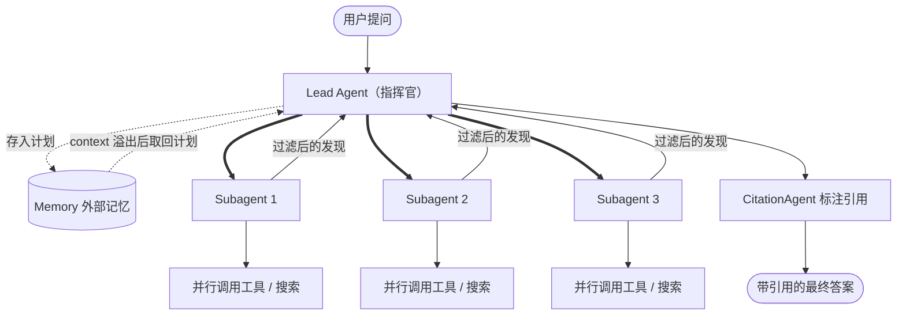
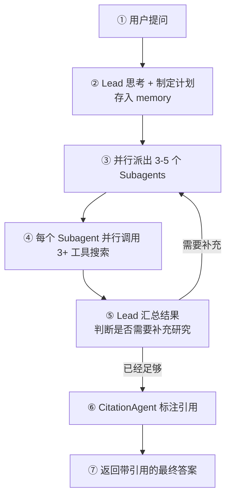

+++
date = '2026-06-10T10:00:00-07:00'
draft = false
title = 'Anthropic Deep Research: Multi-Agent 架构'
+++

Anthropic 发布了一篇很好的工程博客，讲他们如何用 Multi-Agent 架构来构建 Deep Research 功能。这是一个非常典型的 Multi-Agent 架构， 有很多有价值的创新和实践经验， 值得 AI Engineer 学习。

> 原文：[How we built our multi-agent research system](https://www.anthropic.com/engineering/multi-agent-research-system)

## 一、为什么要用 Multi-Agent？

Anthropic 给 Deep Research 的定义：**开放式（open-ended）的问题，很难提前预测需要哪些步骤**。你没法为探索复杂主题写死一条固定路径，因为这个过程本身是动态的、路径依赖（path-dependent）的——随着调查展开，需要灵活地转向或追查旁支线索。

正因为这种开放性，Multi-Agent 架构很合适，原因：

1. **并行探索**：多个 subagents 同时进行，各自用**独立的 context window**，探索问题的不同侧面。
2. **关注点分离（separation of concerns）**：每个 subagent 有自己独立的工具、prompt 和探索轨迹，这降低了路径依赖，让每条调查更深入、更独立。
3. **突破单 context 上限**：研究要处理的信息常常超出 Single-Agent 的 context window，多个 Agent 分摊就能装下更多。

效果有多好？Anthropic 给了一个数字：用 Claude Opus 4 当 lead agent, Claude Sonnet 4 当 subagents 的 Multi-Agent 系统，在内部研究评测上比 Single-Agent （用 Opus 4） **高出 90.2%**。

一个经典例子：找出 S&P 500 里所有 IT 公司的董事会成员。这种需要广度优先、同时铺开多条搜索的任务，Single-Agent 顺序搜索会失败；多个 subagents 并行分工就能搞定。

## 二、架构：Orchestrator-Worker 模式

核心是一个 **指挥官-工人（Orchestrator-Worker）** 模式：

- **Lead Agent**：分析问题、制定策略、把计划存到外部记忆（memory，防止 context 溢出），然后派出多个 subagents。
- **Subagents**：每个拿到一个具体任务，独立去搜索，用 interleaved thinking 评估结果，再把**过滤后**的发现返回给 lead。Subagent 的角色就像一个"智能过滤器"。
- **CitationAgent**：最后专门负责给结论标注引用来源。

下面这张图是系统的整体结构——一个 Lead 在上层协调，多个 Subagents 在下层并行干活：

如果按时间顺序看，整个流程是这样的，注意 Lead 汇总后可以**回头补充研究**，形成一个循环：

关键在于**并行**：Lead 一次起 3-5 个 subagents，每个 subagent 又并行调用多个工具。对复杂问题，研究时间最多能**减少 90%**。

## 三、并行的代价：Token 经济学

天下没有免费的午餐。并行很快，但很烧 token：

- 普通 chat：基准
- Single-Agent：约 **4 倍** token
- Multi-Agent：约 **15 倍** token

所以一条重要原则：**只有当任务价值足够高，能覆盖这个成本时，才值得用 Multi-Agent。**

为什么 Multi-Agent 能赢？Anthropic 给了一个很反直觉、却很核心的结论：

> Multi-agent systems work mainly because they help spend enough tokens to solve the problem.
> （Multi-Agent 之所以有效，主要是因为它们能花掉足够多的 token 来解决问题。）

数据也支持这点：在 BrowseComp 评测上，**token 用量、工具调用次数、模型选择**这三个因素一起能解释 **95%** 的性能差异，其中**仅 token 用量一项就解释了 80%**。换句话说，给任务"喂"足够多的 token 去探索，本身就是性能的主要来源——而 Multi-Agent 正是一种把 token 用量扩展到 Single-Agent 装不下的程度的方式。

## 四、Prompt Engineering 的关键经验

每个 Agent 都由一段 prompt 来驱动，所以正如原文所说：**"prompt engineering 是我们改进这些行为的主要杠杆（primary lever）。"** Anthropic 总结了 8 条原则：

1. **Think like your agents（像你的 Agent 一样思考）**：一步步观察 Agent 的行为，才能看清失败模式（派了太多 subagents、query 太啰嗦、用错工具）。
2. **Teach the orchestrator how to delegate（教指挥官如何分工）**：派任务时必须写清楚——目标、输出格式、用什么工具、边界在哪。
3. **Scale effort to query complexity（让投入匹配问题复杂度）**：在 prompt 里写明规则。简单事实 = 1 个 agent / 3-10 次调用；对比类 = 2-4 个 subagents；复杂研究 = 10+ 个 subagents 分工。
4. **Tool design and selection are critical（工具设计与选择至关重要）**：把工具接口当成 UX 来设计。Agent 选错工具几乎必败，每个工具要有清晰、互不重叠的描述。
5. **Let agents improve themselves（让 Agent 自我改进）**：Claude 4 能自己诊断失败、改进 prompt。一个"工具测试 Agent"重写工具描述后，让后续 Agent 的任务完成时间**减少了 40%**。
6. **Start wide, then narrow down（先宽后窄）**：先用简短、宽泛的 query，看看有什么，再逐步收窄——这模仿了人类专家的研究方式。
7. **Guide the thinking process（引导思考过程）**：用 extended thinking 当"可控的草稿纸"。Lead 用它来规划；Subagents 在每次工具调用后用 interleaved thinking 评估质量、找差距、优化下一步。
8. **Parallel tool calling transforms speed（并行调用工具，大幅提速）**：Lead 并行起 subagents，subagent 又并行调工具，把复杂研究的时间最多压缩 **90%**。

## 五、评估（Evaluation）

- **从小处开始**：用约 20 个真实场景的 query 就够了，早期迭代的影响巨大（成功率能从 30% 提到 80%）。
- **LLM-as-judge**：用一个 prompt 给 0.0-1.0 的分数，按多个维度打分：事实准确性、引用准确性、完整性、来源质量、工具效率。
- **人工评估不可省**：人能发现 LLM 评委漏掉的问题，比如 Agent 偏爱 SEO 内容农场，而不是权威的学术 PDF。

## 六、生产环境的挑战

把 Agent 放到生产环境，会遇到普通软件没有的难题：

- **状态与错误累积**：Agent 长时间运行并保持状态，一个小错误会层层放大。对策：用可持久化的执行、checkpoint 续跑、让 Agent 优雅地应对工具失败。
- **非确定性调试**：同样的 prompt，每次运行决策都可能不同。对策：做完整的 production tracing，监控决策模式。
- **部署协调**：更新时 Agent 可能正跑到一半。对策：用 rainbow deployment，新旧版本同时在线，逐步切流量。

## 要点速记

- **Why**：研究任务不可预测、信息超出 Single-Agent context、可并行 → Multi-Agent。
- **架构**：Orchestrator-Worker，Lead 分工 + Subagents 并行 + CitationAgent 引用。
- **数字**：比 Single-Agent 高 90.2%；时间省 90%；但 token 是 chat 的 15 倍；token 一项就解释 80%（三因素共 95%）的性能差异。
- **核心结论**：Multi-Agent 有效，主要是因为它能"花掉足够多的 token 来解决问题"。
- **Prompt**：prompt engineering 是主要杠杆——分工要具体、投入匹配复杂度、工具设计即 UX、先宽后窄、让 Agent 自我改进、善用并行。

一句话：**Multi-Agent 适合高价值、可并行、信息量超过单个 context 的任务；但要靠精细的 prompt engineering、好的工具设计、扎实的评估，以及能扛住长时间运行的生产系统。**
