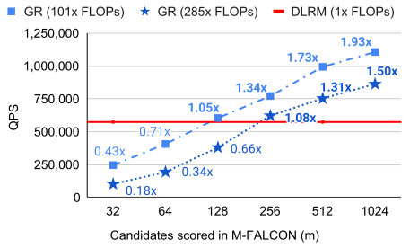

+++
date = '2026-09-20T10:00:00-07:00'
draft = false
title = 'Meta HSTU 解释和思考：如何把推荐系统做大'
tags = ['ai', '推荐系统', '生成式推荐', 'hstu', 'generativerecommender', 'dlrm', 'scalinglaw', 'meta', '人工智能', 'ai学习', '大模型']
summary = """
  *Meta HSTU 把推荐系统中的 Retrieval和 Ranking 重构为用户序列预测问题， 统一模型特征为一个用户序列，并用高效设计的HSTU Attention Block、Stochastic Length 和 M-FALCON 大幅训练与推理成本。最终，1.5 万亿参数的大推荐系统模型在A/B Test 中最高提升 12.4%，并呈现跨三个数量级的 Compute Scaling Law。*
"""
+++

*Meta HSTU 把推荐系统中的 Retrieval和 Ranking 重构为 seq2seq 预测问题， 统一模型特征为一个用户序列，并用高效设计的HSTU Attention Block、Stochastic Length 和 M-FALCON 大幅训练与推理成本。最终，1.5 万亿参数的大推荐系统模型在A/B Test 中最高提升 12.4%，并呈现跨三个数量级的 Compute Scaling Law。*

论文：**[Actions Speak Louder than Words: Trillion-Parameter Sequential Transducers for Generative Recommendations](https://arxiv.org/abs/2402.17152)**（Zhai et al., Meta, ICML 2024）

代码：**[meta-recsys/generative-recommenders](https://github.com/meta-recsys/generative-recommenders)**

---

## TL;DR

传统工业推荐模型 DLRM 依赖大量人工构造的 categorical feature、counter、ratio 和复杂的 feature interaction module。模型虽然参数很多、数据很多，但继续增加计算量时，效果常常很快饱和。

这篇论文提出 **Generative Recommender（GR）**：把 item、用户 action 和其他 categorical feature 按时间合并成一条序列，再把 Retrieval 与 Ranking 都写成 sequence prediction。这里的“生成式”不是生成文字或视频，而是**对用户行为序列建模，并预测下一个 item 或 action**。

整套系统有四个关键部分：

1. **统一 Feature Space**：把异构 categorical feature sequentialize；让模型从原始历史中学习原本由 counter、ratio 表达的统计信息。
2. **Generative Training**：按用户或 session 训练，一次 encoder forward 同时监督多个时间点，避免为每次 impression 重复计算相同历史，理论上减少一个 `O(N)` 因子的计算。
3. **HSTU Encoder**：用不做 sequence-wise softmax 的 pointwise attention 保留兴趣强度，以 gating 代替复杂 feature interaction，并针对 jagged、超长推荐序列优化内存和 kernel。
4. **M-FALCON Serving**：把大量候选 item 分成 micro-batch，复用用户历史的计算和 KV cache，让更复杂的 target-aware 模型仍能低成本在线服务。

结果很亮眼：最大模型达到 **1.5T 参数**；生产 Ranking A/B Test 的两个主要指标提升 **12.4% / 4.4%**；长度 8,192 时，HSTU 训练速度比基于 FlashAttention-2 的 Transformer 快 **5.3x-15.2x**。更重要的是，GR 的效果随训练 compute 在三个数量级上近似 power law 增长，而 DLRM 很快进入平台期。

## 先澄清：“Generative”到底指什么？

这篇论文的 Generative Recommender 容易被误解成“用 LLM 生成推荐理由”或“直接生成内容”。两者都不是。

先看与两项核心任务直接相关的两类 token：

* **Content / Item**：系统展示的图片、视频或商品。
* **Action**：用户对 item 的反应，例如 click、skip、like、完成观看或 share。

两者按时间交错排列：

```text
item₀ → action₀ → item₁ → action₁ → ...
```

模型在这条序列上选择不同的 prediction target，就得到两类核心任务：

* **Retrieval**：根据此前历史预测下一个发生正向互动的 item。
* **Ranking**：把候选 item 接到历史后面，预测用户将对它采取什么 action。

真实输入还会把语言、城市、关注的 creator 等较低频 categorical feature 按时间插入同一条序列。这里的“生成式”更准确地说，是在统一序列上定义不同的 sequential transduction 目标：Retrieval 预测 item，Ranking 预测 action；它并不要求同一个训练目标生成序列里的每一种 token。

Ranking 之所以把 item 和 action 交错排列，是为了让候选 item 尽早与完整历史发生 target-aware interaction。模型不是先生成一个通用 user embedding，再在最后用一次 dot product 打分；候选 item 本身会参与对历史的 attention。

这个定义也说明它与 [TIGER](../tiger-generative-retrieval/)、[PLUM](../plum/) 和 [OneRec](../onerec/) 的差别：这些后续工作通常把 item 转换成多层 **Semantic ID** 再逐 token 生成；HSTU 论文主要使用大规模 atomic ID，把重点放在**统一序列建模、Scaling Law 和工业系统效率**上。

## 从 DLRM 到一条统一的行为序列

工业 DLRM 的输入远比“用户看过哪些 item”复杂：

* 高频 categorical feature：观看、点赞、关注等行为；
* 低频 categorical feature：语言、城市、关注的 creator、加入的 community；
* numerical feature：CTR、带时间衰减的计数和各种 ratio；
* 为不同业务与目标手工设计的 feature cross。

GR 首先把用户互动合成主时间线。对于人口属性、关注 creator 这类变化较慢的 feature，只保留连续区间里的首次变化，再按时间合并到主序列中。


*从 DLRM 到 GR：不仅模型结构变了，Feature Space 和训练样本的组织方式也一起改变。（[论文](https://arxiv.org/abs/2402.17152) Figure 2。）*

对于 CTR、counter 等频繁变化的 numerical feature，论文做了更激进的选择：**不再直接输入它们**。这些统计量本来就是从用户的历史行为和 categorical feature 聚合而来；只要序列足够长、模型表达能力足够强，模型应该能从原始历史中重新学出来。

这是一笔很明确的交换：减少 feature engineering，把负担转移给更长的序列和更多 compute。论文的工业实验也支持这个方向——如果把 GR 使用的精简 feature 同样交给 DLRM，DLRM 明显退化；GR 则能从统一序列中恢复许多原来由手工 feature 提供的信息。

## Generative Training：一次计算，多处监督

传统 impression-level training 会在每次曝光后创建一个样本。假设一个用户有长度为 `N` 的历史，训练第 `i` 个目标时又要重新编码前 `i` 个 token，许多相同前缀被重复计算。

GR 改为按用户请求或 session 产生训练样本：一次处理整条序列，并在多个位置计算 loss。Encoder 的成本被多个 target 共同分摊。令 `N` 为最长序列长度；在论文的 streaming sampling 推导中，如果长度为 `nᵢ` 的用户序列以 `sᵤ(nᵢ)=1/nᵢ` 的频率采样，总复杂度就减少一个 `O(N)` 因子：

```text
Impression-level training: O(N³d + N²d²)
Generative training:       O(N²d + Nd²)
```

这一步很关键。基于 HSTU 的 GR 能扩展到万亿参数规模，不只是因为某个 attention kernel 更快，而是因为**训练单位从一次 impression 变成了一整段用户历史**，先消除了系统中最大的一类重复计算。

## HSTU：为推荐数据重新设计的 Attention Block

HSTU 全称 **Hierarchical Sequential Transduction Unit**。它由重复堆叠的 residual block 构成，每层可以简化为三步：

```text
1. Pointwise Projection:     U, V, Q, K = Split(SiLU(Linear(X)))
2. Spatial Aggregation:      Z = SiLU(QKᵀ + relative bias) · V
3. Pointwise Transformation: Y = Linear(LayerNorm(Z) ⊙ U)
```

这里有两次 SiLU：第一次用于生成 `U/V/Q/K`，第二次逐点作用于 attention score，取代沿序列维度归一化的 softmax。Relative attention bias 同时编码位置差和时间差；`⊙ U` 是 element-wise gating，用来完成 feature interaction。


*HSTU 的目标不是把 Transformer 原样搬进推荐系统，而是用一种可重复扩展的 block 替代 DLRM 中异构、专用的模块。（[论文](https://arxiv.org/abs/2402.17152) Figure 3。）*

### 为什么不用普通 Softmax Attention？

普通 Transformer 会沿 sequence dimension 对 attention score 做 softmax，使每个 query 对历史的权重之和固定为 1。HSTU 改用逐点的 SiLU 激活，然后直接聚合 value。

这样做主要有两个原因：

* **保留兴趣强度**：用户相关历史出现 2 次还是 200 次，本身就是重要信号。Softmax 把 attention weight 归一化为总和为 1 的相对分配，容易弱化证据数量；pointwise aggregation 不施加这一约束，让相关历史的数量能够影响聚合结果。
* **适应非平稳 vocabulary**：推荐内容持续创建和消失，item vocabulary 不断变化。论文的 synthetic streaming experiment 中，HSTU pointwise attention 的 HR@10 为 `0.0893`，换成 softmax 后是 `0.0617`。

聚合后必须使用 LayerNorm 稳定训练。换句话说，HSTU 不是简单“删除 softmax”，而是用 **pointwise activation + aggregation + post-aggregation normalization** 替代它。

### 为什么它更省？

论文利用了推荐数据与语言数据不同的几个特点：

* **Jagged Sequence**：用户历史长度高度不均匀。HSTU 使用 ragged attention kernel，只计算真实 token，不为空白 padding 付费，带来 `2x-5x` throughput gain。
* **Stochastic Length（SL）**：长历史里行为具有多时间尺度的重复性。训练时，大部分长序列只随机保留一个 subsequence，偶尔仍使用完整历史。`α=1.6` 时，长度 4,096 的序列大多数时候缩短为 776；在 `64%-84%` sparsity 下，主要任务的 Normalized Entropy 退化不超过 `0.002`。
* **更少 Activation**：HSTU 把 attention 外的 linear layer 从 6 个减少到 2 个，并大量做 operator fusion。论文估算每层 activation state 从 Transformer 的 `33d` 降到 `14d`，同样内存可堆叠超过 2 倍深度。
* **大 Vocabulary 的内存优化**：10B vocabulary、512 维 embedding 加 fp32 Adam state 理论上需要约 60TB。论文用 row-wise AdamW，并把 optimizer state 放到 DRAM，把每个 embedding float 的 HBM 占用从 12 bytes 降到 2 bytes。

这些工程设计共同带来的结果是：在 8,192 sequence length 上，HSTU 训练比 FlashAttention-2 Transformer 快 `5.3x-15.2x`，inference 最多快 `5.6x`。

## M-FALCON：如何为上万个候选做 Target-aware Ranking？

Ranking 的难点是，一次请求可能要给成千上万个候选 item 打分。如果每个候选都与用户历史单独做一次 cross-attention，再大的离线模型也无法上线。

论文提出 **M-FALCON（Microbatched-Fast Attention Leveraging Cacheable OperatioNs）**：

1. 缓存与候选无关的用户历史 KV；
2. 把候选分成 micro-batch；
3. 修改 attention mask 和 relative bias，让同一批候选在一次 forward 中各自读取相同历史，但彼此不可见；
4. 在多个 micro-batch，甚至多个 request 之间复用缓存。

这让 target-aware attention 的主要历史计算不再按候选数重复。生产配置中，GR 的模型 FLOPs 虽然是 DLRM 的 **285 倍**，但给 1,024 / 16,384 个候选打分时，QPS 反而是 DLRM 的 **1.50x / 2.99x**。



*M-FALCON 把“更大的模型”转化为“更充分地复用同一份用户历史计算”。（[论文](https://arxiv.org/abs/2402.17152) Figure 6。）*

## 实验结果

论文先在 MovieLens 和 Amazon Reviews 上与 SASRec 比较，再在 Meta 的 one-pass streaming dataset 上做离线实验和线上 A/B Test。Public dataset 上，HSTU 相比 baseline 的 NDCG 最多提升 **65.8%**；但真正重要的是工业结果。

### Retrieval

| 模型 | HR@100 | HR@500 | 线上 E-Task | 线上 C-Task |
|:---|---:|---:|---:|---:|
| DLRM | 29.0% | 55.5% | 0% | 0% |
| GR（new source） | **36.9%** | **62.4%** | **+6.2%** | **+5.0%** |
| GR（replace source） | - | - | **+5.1%** | **+1.9%** |

*数据来自[论文](https://arxiv.org/abs/2402.17152) Table 6。New source 表示增加一个 GR retrieval source；replace source 表示替换原来的主 DLRM source。*

### Ranking

| 模型 | E-Task NE | C-Task NE | 线上 E-Task | 线上 C-Task |
|:---|---:|---:|---:|---:|
| DLRM | 0.4982 | 0.7842 | 0% | 0% |
| GR（interactions only） | 0.4851 | 0.7903 | - | - |
| **完整 GR** | **0.4845** | **0.7645** | **+12.4%** | **+4.4%** |

*数据来自[论文](https://arxiv.org/abs/2402.17152) Table 7。Normalized Entropy（NE）越低越好。*

`interactions only` 只保留用户互动 item，接近传统 sequential recommender；它在 C-Task 上明显弱于完整 GR。这说明“把推荐变成序列”还不够，低频 contextual categorical feature 也必须进入统一时间线。

## 最重要的结果：推荐系统也出现了 Scaling Law

论文分别扩大 HSTU 的层数、sequence length、embedding dimension、attention head 和 retrieval negatives。DLRM 在约 **200B 参数**附近逐渐饱和；GR 则一直扩展到 **1.5T 参数**。


*GR 的 Ranking 效果随 compute 在三个数量级上持续改善。（[论文](https://arxiv.org/abs/2402.17152) Figure 7 bottom。）*

最大实验配置为 8,192 sequence length、1,024 embedding dimension 和 24 层 HSTU。Retrieval 的 HR@100 / HR@500 与 Ranking 的 NE 都呈现近似 power-law trend，而且 sequence length 比在语言模型中更重要——扩大模型宽度和深度时，也要同步给它更长的用户历史。

不过，**基于 HSTU、参数量达 1.5T 的 GR 不能简单等同于 1.5T dense LLM**。GR 使用十亿级 atomic ID vocabulary，因此总参数量中包含庞大的 embedding table，每次请求只访问其中很小一部分。论文也扩展了 non-embedding parameters，但 1.5T 这个数字仍然不能理解成每个 token 都经过 1.5T dense parameters 的计算。

## 我的一些想法

### 1. 真正的创新是四层共同设计

只看 HSTU attention equation，会低估这篇论文。它的完整逻辑是：

```text
统一 Feature Space
        ↓
按用户序列做 Generative Training
        ↓
用 HSTU + Stochastic Length 扩大训练
        ↓
用 M-FALCON 把复杂模型部署到线上
```

Feature、objective、model architecture 和 serving algorithm 缺一不可。没有 generative training，重复前缀计算会吞掉训练预算；没有 M-FALCON，target-aware ranking 无法处理大量候选；没有统一序列，再大的模型仍被旧 feature pipeline 限制。

### 2. 从 Feature Engineering 转向 Compute Scaling

DLRM 的改进通常来自更多人工 feature 和更复杂的交叉模块；GR 希望把它们压缩成统一的原始事件流，让模型通过规模学习统计量与交互关系。

这与 NLP 从 feature engineering 转向预训练模型很相似。但推荐领域有自己的条件：vocabulary 更大、更动态，训练数据持续 streaming，而且用户历史长度和 action intensity 都是重要信号。因此，推荐系统需要的未必是标准 Transformer，而是 HSTU 这种针对新 modality 修改过的架构。

### 3. “Actions Speak Louder than Words”有数据支持

论文中 content-only GR 的 HR@100 只有 `11.6%`，DLRM 是 `29.0%`，使用用户互动历史的完整 GR 达到 `36.9%`。至少在大规模推荐中，只理解内容语义远远不够；高基数、按时间排列的真实 action 才是最有信息量的监督。

### 4. 论文也有明显局限

* **工业结果难以独立复现**：关键结论来自未公开的 Meta 数据、硬件和 serving stack；线上指标经过匿名化，读者不知道 `+12.4%` 对应的具体产品目标。
* **1.5T 参数容易被误读**：论文同时扩展了 embedding 与 non-embedding parameters；但总参数量包含庞大的 atomic ID embedding table，不能直接与 dense LLM 的参数量比较。
* **Scaling Law 是经验结果，不是永久保证**：论文只验证到当时能测试的 compute 范围；更大规模是否继续按同一斜率改善仍未知。
* **Atomic ID 的泛化问题仍在**：新 item 不天然共享语义结构。TIGER、PLUM 等 Semantic ID 路线，正是在尝试改善这一点。
* **更强的行为建模也会更强地学习既有偏差**：曝光机制、热门内容和短期 engagement 会形成 feedback loop。序列更长、模型更大并不会自动带来多样性、公平性或长期用户价值，这仍需要 objective 与 evaluation 的配合。

## 大方向

HSTU 论文最重要的结论不是“推荐系统也应该使用 Transformer”，而是：**把用户 action 当成一种独立的生成式 modality，并围绕它重新设计整个系统，推荐模型才可能真正从 compute scaling 中获益。**

它为后来的生成式推荐提供了另一条关键路线。Semantic ID 工作解决“怎样用 token 表示 item”；HSTU 则集中回答“怎样把工业推荐的完整问题转成可扩展的 sequence modeling”。两条路线最终很可能汇合：用有语义结构的 item token 表示内容，再用 HSTU 这类为长行为序列设计的模型统一 Retrieval、Ranking 和长期用户建模。

## 参考文献

1. Zhai et al. **[Actions Speak Louder than Words: Trillion-Parameter Sequential Transducers for Generative Recommendations](https://arxiv.org/abs/2402.17152)**. ICML 2024。
2. Kang & McAuley. **[Self-Attentive Sequential Recommendation (SASRec)](https://arxiv.org/abs/1808.09781)**. ICDM 2018。
3. Rajput et al. **[Recommender Systems with Generative Retrieval (TIGER)](https://arxiv.org/abs/2305.05065)**. NeurIPS 2023。— [我的解读](../tiger-generative-retrieval/)
4. He et al. **[PLUM: Adapting Pre-trained Language Models for Industrial-scale Generative Recommendations](https://arxiv.org/abs/2510.07784)**. 2025。— [我的解读](../plum/)

---

#ai #推荐系统 #生成式推荐 #hstu #generativerecommender #dlrm #scalinglaw #meta #人工智能 #ai学习 #大模型

如果你觉得本文有帮助，欢迎[点赞关注](https://www.rednote.com/user/profile/61d67d89000000001000c76b)支持！

If you like this post, consider star [the repo](https://github.com/sleepingbear-ai/sleepingbear-ai.github.io).
