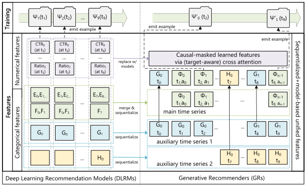
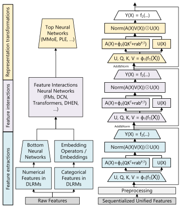
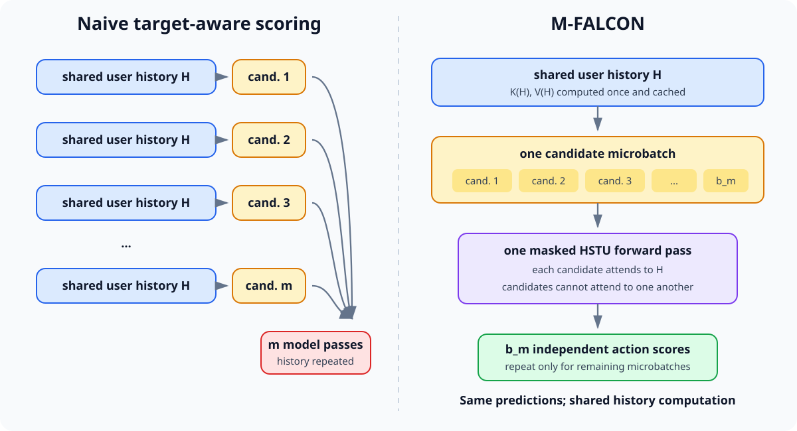
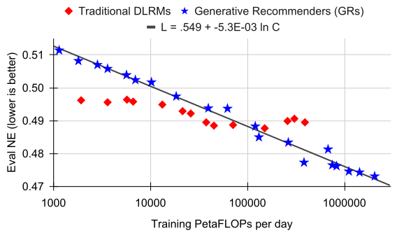

+++
date = '2026-09-20T10:00:00-07:00'
draft = false
title = 'Meta HSTU 解释和思考：如何把推荐系统做大'
tags = ['ai', '推荐系统', '生成式推荐', 'hstu', 'generativerecommender', 'dlrm', 'scalinglaw', 'meta', '人工智能', 'ai学习', '大模型']
summary = """
  *Meta HSTU 把推荐系统中的 Retrieval和 Ranking 重构为用户序列预测问题， 统一模型特征为一个用户序列，并用高效设计的HSTU Attention Block、Stochastic Length 和 M-FALCON 大幅降低训练与推理成本。最终，1.5 万亿参数的大推荐系统模型在A/B Test 中最高提升 12.4%，并呈现跨三个数量级的 Compute Scaling Law。*
"""
+++

*Meta HSTU 把推荐系统中的 Retrieval和 Ranking 重构为用户序列预测问题， 统一模型特征为一个用户序列，并用高效设计的HSTU Attention Block、Stochastic Length 和 M-FALCON 大幅降低训练与推理成本。最终，1.5 万亿参数的大推荐系统模型在A/B Test 中最高提升 12.4%，并呈现跨三个数量级的 Compute Scaling Law。*

论文：**[Actions Speak Louder than Words: Trillion-Parameter Sequential Transducers for Generative Recommendations](https://arxiv.org/abs/2402.17152)**（Zhai et al., Meta, ICML 2024）

代码：**[meta-recsys/generative-recommenders](https://github.com/meta-recsys/generative-recommenders)**

---

## TL;DR

传统工业推荐中的 **Deep Learning Recommendation Model（DLRM）** 依赖大量人工构造的 categorical, numerical features 和复杂的 feature interaction module。但scale up 模型时效果不一定有突破。

这篇论文提出 **Generative Recommender（GR）**：把 item、用户 action 和其他 categorical feature 按时间合并成一条序列，再把 Retrieval 与 Ranking 都重构成序列预测问题。这里的“生成式”不是生成文字或视频，而是**对用户行为序列建模，并预测序列中下一个 item 或 action**。

整套系统的关键：

1. **统一 Feature Space**：把异构 categorical feature sequentialize；让模型从原始用户序列中学习原本由 counter、ratio 表达的统计特征。
2. **HSTU Encoder**：设计高效的Attention Block，并针对 jagged、超长推荐序列优化内存和 kernel。
3. **M-FALCON Serving**：把大量候选 item 分成 micro-batch，复用用户历史的计算和 KV cache，让复杂的 target-aware 模型能高效实现。

结果很亮眼：最大模型达到 **1.5T 参数**；生产系统 A/B Test 的两个主要指标提升 **12.4% / 4.4%**；用户序列长度 8,192 时，HSTU 训练速度比基于 FlashAttention-2 的 Transformer 快 **5.3x-15.2x**。更重要的是，GR 的效果随训练 compute 在三个数量级上近似 power law 增长。

## 把 Retrieval 和 Ranking 重构为 Seq2Seq 预测问题

这篇论文把推荐写成 **sequence-to-sequence（Seq2Seq）预测问题**，但 Retrieval 和 Ranking 使用不同的 input/output sequence。

用一个最简单的例子说明。假设用户依次看了做饭、旅行和篮球三个视频，对应的 action 分别是点赞、看完和跳过。完整序列是：

```text
做饭视频 → 点赞 → 旅行视频 → 看完 → 篮球视频 → 跳过
```

对于 **Ranking**，输入是 item 与 action 交错的序列；模型在每个 item 的位置预测用户对它采取的 action：

```text
Ranking input:   做饭视频 → 点赞 → 旅行视频 → 看完 → 篮球视频 → 跳过
Ranking output:  点赞     →  ∅   → 看完     →  ∅   → 跳过     →  ∅
```

例如，对候选“篮球视频”，模型预测用户会“跳过”。

Ranking 学习的是：

```text
p(action | 用户历史, candidate item)
```

对于 **Retrieval**，论文把每个 `(item, action)` 组合成一个输入 token。输出是下一个 item，但只有当用户对这个 item 的 action 是正向的，它才会成为训练 target；否则输出为无定义 `∅`：

```text
Retrieval input:   (做饭视频, 点赞) → (旅行视频, 看完) → (篮球视频, 跳过)
Retrieval output:   旅行视频         →  ∅               →  ∅
```

这里“旅行视频”的 action 是“看完”，属于正向互动，所以它是第一个输入 token 对应的 next-item target。“篮球视频”被用户跳过，不是正向互动，因此不会成为 Retrieval target，而是被 mask 为 `∅`；最后一个位置没有 next item，输出同样为 `∅`。Retrieval 学习的是：

```text
p(下一个正向互动的 item | 用户历史)
```

两项任务都是 sequential transduction，但输出序列不同：Ranking 预测与每个候选 item 对应的 action，Retrieval 预测下一个获得正向反馈的 item。模型只在输出不为 `∅` 的位置计算训练 loss。

## 特征：统一的时间序列

工业 DLRM 的输入特征远比“用户看过哪些 item”复杂：

* 高频 categorical feature：观看、点赞、跳过、分享、完播等行为；
* 低频 categorical feature：语言、城市、关注的 creator、加入的 community；
* numerical feature：CTR、带时间衰减的计数和各种 ratio；
* 为不同业务与目标手工设计的 feature cross。

GR 把这些特征统一成一条按时间排列的序列：

* 首先把用户行为依照时间顺序合并成一个序列。
* 对于用户属性、关注 creator 这类变化较慢的 feature，只保留每个连续不变区间的第一条记录，再按时间合并到主序列中。
* 对于 CTR、counter 等频繁变化的 numerical feature，**不再使用它们**。这些统计特征本来就是从用户的历史行为和 categorical feature 统计而来；只要序列足够长，并配合表达能力足够强的 target-aware sequential model，模型应该能从原始历史中重新学出来。

举个简单的例子。假设用户在北京看完了一个旅行视频，之后关注了 creator“小李”，又跳过了一个做饭视频。DLRM 通常会把这些信息拆成不同的 feature：

```text
历史 item:       [旅行视频, 做饭视频]
历史 action:     [看完, 跳过]
城市:            北京
关注的 creator:  小李
最近 2 次完播率:  50%
```

GR 不再把它们作为彼此分离的 feature fields，而是保留原始 categorical event，并按发生时间合并成一条序列。沿用前文的交错表示，可以简化为：

```text
[城市: 北京] → [旅行视频] → [看完] → [关注 creator: 小李] → [做饭视频] → [跳过]
```

像“最近 2 次完播率 50%”这样的 numerical feature 不进入序列，因为它本来就可以从历史 event 统计出来。



*从 DLRM 到 GR：不仅模型结构变了，Feature Space 和训练样本的组织方式也一起改变。（[论文](https://arxiv.org/abs/2402.17152) Figure 2。）*

这个方法减少 feature engineering，但依靠更长的用户序列和更多 compute。

## HSTU：为推荐系统重新设计的 Attention Block

HSTU 全称 **Hierarchical Sequential Transduction Unit**。它由重复堆叠的 residual block 构成，每层可以简化为三步：

```text
1. U, V, Q, K = Split(SiLU(Linear(X)))
2. Z = SiLU(QKᵀ + relative bias) · V
3. Y = Linear(LayerNorm(Z) ⊙ U)
```

这里有两次 SiLU：第一次用于生成 `U/V/Q/K`，第二次逐点作用于 attention score，取代沿序列维度的 softmax。Relative attention bias 同时编码位置差和时间差；`⊙ U` 是 element-wise gating，用来完成 feature interaction。



*HSTU 的目标不是把 Transformer 原样搬进推荐系统，而是用一种可重复扩展的 block 替代 DLRM 中异构、专用的模块。（[论文](https://arxiv.org/abs/2402.17152) Figure 3。）*

### 为什么不用普通 Softmax Attention？

普通 Transformer 会沿 sequence dimension 对 attention score 做 softmax，使每个 query 对历史的权重之和固定为 1。HSTU 没有用Softmax, 有两个原因：

* **保留兴趣强度**：用户相关历史出现 2 次还是 10 次，本身就是重要信号。Softmax 把 attention weight 归一化为总和为 1 的相对分配，容易弱化证据数量.
* **适应变化的 vocabulary**：推荐内容持续创建和消失，item vocabulary 不断变化。论文的 synthetic streaming experiment 中，HSTU 的 HR@10 为 `0.0893`，换成 softmax 后是 `0.0617`。

聚合后必须使用 LayerNorm 稳定训练。换句话说，HSTU 不是简单“删除 softmax”，而是用 **pointwise activation + aggregation + post-aggregation normalization** 替代它。

### 为什么HSTU更高效？

* **Jagged Sequence**：用户历史长度高度不均匀。HSTU 使用 ragged attention kernel，只计算真实 token，不为空白 padding 付费，带来 `2x-5x` throughput gain。
* **Stochastic Length（SL）**：训练时，大部分长序列只随机保留一个 subsequence，偶尔仍使用完整历史。实验中， `α=1.6` 时，长度 4,096 的序列大多数时候缩短为 776， 但对模型效果影响甚微。
* **更少 Activation Memory**：HSTU 把 attention 外的 linear layer 从 6 个减少到 2 个，并大量做 operator fusion。论文估算每层 activation state 从 Transformer 的 `33d` 降到 `14d`，同样内存空间可堆叠超过 2 倍深度的Layer。
* **大 Vocabulary 的内存优化**：10B vocabulary、512 维 embedding 加 fp32 Adam Optimizer state 理论上需要约 60TB。论文用 row-wise AdamW，并把 optimizer state 放到 DRAM，把每个 embedding float 的 HBM 占用从 12 bytes 降到 2 bytes。

这些工程设计带来的结果是：在 8,192 sequence length 上，HSTU 训练比 FlashAttention-2 Transformer 快 `5.3x-15.2x`，inference 最多快 `5.6x`。

## M-FALCON：用一份用户历史为多个候选打分

假设 Ranking 阶段有 `m` 个候选，所有候选共享一段长度为 `n` 的用户历史。朴素的 target-aware Ranking 会为每个候选分别运行一次推理，重复计算同一段用户历史。

**M-FALCON（Microbatched-Fast Attention Leveraging Cacheable OperatioNs）** 把一组 micro-batch 候选 append 到同一条用户历史序列之后，再修改 attention mask 和 relative position/time bias，让每个候选都能读取用户历史，但不能读取其他候选。这样，一次 forward 就能为整个 micro-batch 打分，并且结果与逐个候选独立打分相同。



*M-FALCON 改变的是执行方式，而不是模型语义：每个候选都能看到用户历史，但候选之间互不可见。（示意图基于[论文](https://arxiv.org/abs/2402.17152) Figure 11 和 Algorithm 1。）*

第一个 micro-batch 会生成用户历史的 Key/Value cache；后续 micro-batch 通过 KV Caching 复用它，只计算候选侧的 projection 和 attention。对于一个大小为 `bₘ` 的 micro-batch，batching 把逐个候选计算 attention 的成本从 `O(bₘn²d)` 降到 `O((n + bₘ)²d)`；当 `bₘ` 相对历史长度 `n` 较小时，后者近似为 `O(n²d)`。

这个优化并不依赖 HSTU，也适用于其他使用 causal self-attention 做 target-aware scoring 的模型。

## 实验结果

论文先在 MovieLens 和 Amazon Reviews 上与 SASRec 比较，HSTU 相比 baseline 的 NDCG 最多提升达到 **65.8%**; 再在 Meta 的 dataset 上做离线实验和线上 A/B Test:

### Retrieval

| 模型 | HR@100 | HR@500 | 线上 E-Task | 线上 C-Task |
|:---|---:|---:|---:|---:|
| DLRM | 29.0% | 55.5% | 0% | 0% |
| GR（new source） | **36.9%** | **62.4%** | **+6.2%** | **+5.0%** |
| GR（replace source） | - | - | **+5.1%** | **+1.9%** |

*数据来自[论文](https://arxiv.org/abs/2402.17152) Table 6。New source 表示增加一个 GR retrieval source；replace source 表示替换原来的主 DLRM source。*

### Ranking

| 模型 | E-Task NE | C-Task NE | 线上 E-Task | 线上 C-Task |
|:---|---:|---:|---:|---:|
| DLRM | 0.4982 | 0.7842 | 0% | 0% |
| **完整 GR** | **0.4845** | **0.7645** | **+12.4%** | **+4.4%** |

*数据来自[论文](https://arxiv.org/abs/2402.17152) Table 7。Normalized Entropy（NE）越低越好。*

## 最重要的结果：推荐系统也出现了 Scaling Law

论文分别扩大 HSTU 的层数、sequence length、embedding dimension、attention head 和 retrieval negatives。DLRM 在约 **200B 参数**附近逐渐饱和；GR 则一直扩展到 **1.5T 参数**。



*GR 的 Ranking 效果随 compute 在三个数量级上持续改善。（[论文](https://arxiv.org/abs/2402.17152) Figure 7 bottom。）*

最大实验配置为 8,192 sequence length、1,024 embedding dimension 和 24 层 HSTU。Retrieval 的 HR@100 / HR@500 与 Ranking 的 NE 都呈现近似 power-law trend.

## 我的一些想法

### 从 Meta HSTU 学到什么

Meta HSTU 把多项设计组合起来，才让基于序列的推荐模型能在工业规模下训练和部署。这些方法也可能适用于其他 Generative Recommender：

* **把异构 feature 统一成一条序列**
* **把 Retrieval 和 Ranking 重构为 Seq2Seq 模型**
* **使用 Stochastic Length 降低长序列的训练成本**
* **设计更高效的 Attention Layer，例如 HSTU**
* **使用 M-FALCON 并行计算一批候选 item 的 target-aware attention**

### Open Questions

HSTU 仍然使用庞大且不断变化的 atomic item ID vocabulary。这些 ID 需要巨大的 embedding table，也需要足够多的用户互动数据才能学到有效表示；对于新 item，这个问题尤其明显。

许多后来的 Generative Recommender，例如 [TIGER](../tiger-generative-retrieval/)、[OneRec](../onerec/) 和 [PLUM](../plum/)，改用 **Semantic ID**：先从 item content embedding 得到一小段离散 code，再用这些 code 表示 item。更小的 Semantic ID token vocabulary 能降低 embedding memory 压力，并改善 cold start。一个值得探索的方向，是把 HSTU 的长用户历史建模能力与 Semantic ID 结合起来，构建更强、也更容易扩展的推荐系统。

### 大方向

这篇论文的重要性，在于它提出了一套实用、有效的方法，让基于序列的 Generative Recommender 真正部署到超大规模生产系统。更重要的是，实验为推荐系统中的 **Scaling Law** 提供了证据。

这个结果很令人兴奋：它说明 Generative Recommendation 可能是一条有潜力的路线——通过扩大训练 compute 和模型规模，推荐质量可能获得非常大的提升。

## 参考文献

1. Zhai et al. **[Actions Speak Louder than Words: Trillion-Parameter Sequential Transducers for Generative Recommendations](https://arxiv.org/abs/2402.17152)**. ICML 2024。
2. Kang & McAuley. **[Self-Attentive Sequential Recommendation (SASRec)](https://arxiv.org/abs/1808.09781)**. ICDM 2018。
3. Rajput et al. **[Recommender Systems with Generative Retrieval (TIGER)](https://arxiv.org/abs/2305.05065)**. NeurIPS 2023。— [我的解读](../tiger-generative-retrieval/)
4. Deng et al. **[OneRec: Unifying Retrieve and Rank with Generative Recommender and Preference Alignment](https://arxiv.org/abs/2502.18965)**. 2025。— [我的解读](../onerec/)
5. He et al. **[PLUM: Adapting Pre-trained Language Models for Industrial-scale Generative Recommendations](https://arxiv.org/abs/2510.07784)**. 2025。— [我的解读](../plum/)

---

#ai #推荐系统 #生成式推荐 #hstu #generativerecommender #dlrm #scalinglaw #meta #人工智能 #ai学习 #大模型

如果你觉得本文有帮助，欢迎[点赞关注](https://www.rednote.com/user/profile/61d67d89000000001000c76b)支持！

If you like this post, consider star [the repo](https://github.com/sleepingbear-ai/sleepingbear-ai.github.io).
