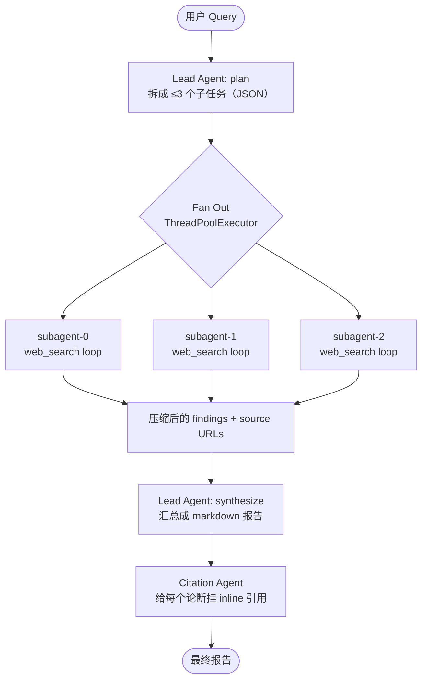

+++
date = '2026-07-20T10:00:00-07:00'
draft = false
title = 'Multi-Agent Deep Research: 原理和代码'
+++

之前写过一篇 [Anthropic Deep Research: Multi-Agent 架构](/posts/anthropic-multi-agent-research/)，讲 Anthropic 是怎么用 Multi-Agent 做 Deep Research 的。我按照那套架构用**139 行 Python** 实现了一个能并行搜索、带引用的 Deep Research。

## 原理：Orchestrator-Worker

Anthropic 的核心思路是 **Orchestrator-Worker**（指挥者—工人）：

- **Lead Agent（指挥者）** —— 拆解问题，把一个大 query 切成几个互不重叠的子任务。
- **Subagents（工人）** —— 每人领一个子任务，**并行**去搜索，各自有独立的 context window，完成任务后只把**压缩过的 findings** 返回给 Lead Agent。
- **Synthesis** —— Lead Agent 把各路 findings 汇总成一篇连贯的报告。
- **Citation** —— 最后统一给报告里的每个论断挂上来源链接。

为什么要多个 Agent？

- **并行探索**：多个 Subagent 同时进行，各自用独立的 context window，探索问题的不同侧面。
- **关注点分离（separation of concerns）**：每个 Subagent 有自己独立的工具、prompt 和 Agentic Loop，这降低了路径依赖，让每条调查更深入、更独立。
- **突破单 context 上限**：Deep Research 要处理的信息常常超出 Single-Agent 的 context window，多个 Agent 分摊是必要的。

Multi-Agent 有效，主要是因为它能 **"花掉足够多的 token 来解决问题"**。Anthropic 用 Claude Opus 4 为 Lead Agent、Claude Sonnet 4 为 Subagent 的系统，在内部研究评测上比 Single-Agent（用 Opus 4）效果高出 90.2%——代价是 token 消耗大得多，所以这套架构只适合**高价值、可并行、超出单 context** 的任务。

## 代码架构图



三个 Subagent 各自跑一个独立的 Agent Loop（调 LLM → 决定搜什么 → 搜 → 再判断），互不干扰。

## 完整代码

```python
"""Multi-Agent Deep Research (minimal). Deps: litellm tavily-python."""

import os
import json
from concurrent.futures import ThreadPoolExecutor

import litellm
from tavily import TavilyClient

tavily = TavilyClient(api_key=os.environ["TAVILY_API_KEY"])

LEAD_MODEL = "gpt-4.1-mini"
SUBAGENT_MODEL = "gpt-4o-mini"
MAX_NUM_AGENTS = 3
MAX_AGENT_LOOP_TIMES = 3

WEB_SEARCH_TOOL = {
    "type": "function",
    "function": {
        "name": "web_search",
        "description": "Search the web. Returns titles, URLs, and snippets.",
        "parameters": {
            "type": "object",
            "properties": {"query": {"type": "string"}},
            "required": ["query"],
        },
    },
}

def web_search(query, agent="system"):
    print(f"[{agent}] search: {query!r}")
    return [
        {"title": r["title"], "url": r["url"], "content": r["content"]}
        for r in tavily.search(query=query, max_results=4)["results"]
    ]

def llm(model, messages, tools=None, response_format=None, max_tokens=2000):
    return litellm.completion(
        model=model, messages=messages, tools=tools,
        response_format=response_format, max_tokens=max_tokens, temperature=0.2,
    ).choices[0].message

def _assistant_to_dict(msg):
    d = {"role": "assistant", "content": msg.content or ""}
    if msg.tool_calls:
        d["tool_calls"] = [
            {"id": tc.id, "type": "function",
             "function": {"name": tc.function.name, "arguments": tc.function.arguments}}
            for tc in msg.tool_calls
        ]
    return d

class Agent:
    def __init__(self, model, system_prompt, name="agent"):
        self.model = model
        self.system_prompt = system_prompt
        self.name = name
        self.sources = []

    def run(self, task):
        messages = [
            {"role": "system", "content": self.system_prompt},
            {"role": "user", "content": task},
        ]
        for _ in range(MAX_AGENT_LOOP_TIMES):
            msg = llm(self.model, messages, tools=[WEB_SEARCH_TOOL])
            messages.append(_assistant_to_dict(msg))
            if not msg.tool_calls:
                return msg.content
            for tc in msg.tool_calls:
                args = json.loads(tc.function.arguments or "{}")
                results = web_search(args.get("query", ""), agent=self.name)
                self.sources.extend(r["url"] for r in results)
                messages.append({"role": "tool", "tool_call_id": tc.id,
                                 "content": json.dumps(results)})
        messages.append({"role": "user", "content": "Stop searching and give your final answer now."})
        return llm(self.model, messages).content

SUBAGENT_SYSTEM = (
    "You are a research subagent. You are given one focused objective.\n"
    "Use the web_search tool to gather evidence, refining queries until you can answer well.\n"
    "Then write condensed findings. For every claim, note the source URL inline, e.g. "
    "(source: https://example.com/page).\n"
    "Output format requested by the lead: {output_format}"
)

PLANNER_SYSTEM = (
    "You are the lead agent of a multi-agent research system.\n"
    "Decompose the query into focused, non-overlapping subtasks for parallel subagents.\n"
    'Respond ONLY with JSON: {"subtasks": [{"objective": "...", "output_format": "..."}]}.'
)

SYNTH_SYSTEM = (
    "You are the lead agent synthesizing a final research report from subagents' findings.\n"
    "Write a well-structured markdown report that answers the query as a coherent narrative.\n"
    "Format the report properly: in a list, all items should be of the same category.\n"
    "Preserve the subagents' inline source attributions. Do NOT add a bibliography or URL list."
)

CITATION_SYSTEM = (
    "You are the citation agent. Ensure every substantive claim carries an inline citation to one "
    "of the available source URLs, formatted as a markdown link like ([example.com](https://example.com/page)).\n"
    "Keep citations inline and minimal. Do NOT append a bibliography. Return the full report markdown."
)

def research(query):
    print(f"[lead] query: {query!r}")
    plan = llm(LEAD_MODEL,
               [{"role": "system", "content": PLANNER_SYSTEM},
                {"role": "user", "content": f"Research query: {query}\nReturn at most {MAX_NUM_AGENTS} subtasks."}],
               response_format={"type": "json_object"})
    subtasks = json.loads(plan.content)["subtasks"][:MAX_NUM_AGENTS]
    print(f"[lead] plan: {[s['objective'] for s in subtasks]}")

    def run_subagent(i, st):
        agent = Agent(SUBAGENT_MODEL,
                      SUBAGENT_SYSTEM.format(output_format=st.get("output_format", "concise bullet points")),
                      name=f"subagent-{i}")
        findings = agent.run(st["objective"])
        return {"objective": st["objective"], "findings": findings, "sources": agent.sources}

    # Fan out: subagents research concurrently in parallel threads.
    with ThreadPoolExecutor(max_workers=MAX_NUM_AGENTS) as ex:
        results = list(ex.map(lambda p: run_subagent(*p), enumerate(subtasks)))

    blocks = "\n\n".join(f"## Subtask: {r['objective']}\n{r['findings']}" for r in results)
    report = llm(LEAD_MODEL,
                 [{"role": "system", "content": SYNTH_SYSTEM},
                  {"role": "user", "content": f"Original query: {query}\n\nSubagent findings:\n{blocks}"}],
                 max_tokens=3000).content

    sources = sorted({u for r in results for u in r["sources"]})
    return llm(LEAD_MODEL,
               [{"role": "system", "content": CITATION_SYSTEM},
                {"role": "user", "content": f"Report:\n{report}\n\nAvailable source URLs:\n" + "\n".join(sources)}],
               max_tokens=3000).content

if __name__ == "__main__":
    print(research("Best practices for prompt engineering?"))
```

## 代码讲解

- **Lead 在 `research()` 里指挥全局** —— 三次 LLM call，每次配一个 prompt。`PLANNER_SYSTEM` 把 query 变成一个 JSON 的子任务列表，数量上限是 `MAX_NUM_AGENTS`：

    ```python
    PLANNER_SYSTEM = (
        "You are the lead agent of a multi-agent research system.\n"
        "Decompose the query into focused, non-overlapping subtasks for parallel subagents.\n"
        'Respond ONLY with JSON: {"subtasks": [{"objective": "...", "output_format": "..."}]}.'
    )
    ```

    "focused, non-overlapping" 就是全部的分工规则；固定的 JSON 结构则保证这个 plan 能被解析。

    比如 query *巴黎旅行攻略 几天合适*，会被拆成三个 objective：

    1. "研究一次典型的巴黎行程到底需要几天"
    2. "找出巴黎有哪些主要景点、它们如何影响停留时长"
    3. "针对 3 天 / 5 天 / 7 天分别给出行程建议"

    每个 objective 创建一个 Subagent —— 这里是三个 —— 因为谁都不依赖别人的输出，它们通过 `ThreadPoolExecutor` fan out，**并行**跑。之后用 prompt `SYNTH_SYSTEM` 做一次 LLM call 把各 Subagent 的 findings 合成最终报告，再用 prompt `CITATION_SYSTEM` 做一次 LLM call 处理引用。

- **`Agent.run(task)` 是一个标准的 Agentic Search Loop** —— 拿到 Lead 分配的 objective（`task`），带着 `web_search` 工具调 LLM，LLM 决定要搜就去搜，把结果喂回给 LLM，如此反复，直到 LLM 收集到足够信息能作答。

    这个 loop 由 prompt `SUBAGENT_SYSTEM` 驱动：

    ```python
    SUBAGENT_SYSTEM = (
        "You are a research subagent. You are given one focused objective.\n"
        "Use the web_search tool to gather evidence, refining queries until you can answer well.\n"
        "Then write condensed findings. For every claim, note the source URL inline, e.g. "
        "(source: https://example.com/page).\n"
        "Output format requested by the lead: {output_format}"
    )
    ```

    prompt 中 "refining queries until you can answer well" 是 loop 能一直迭代下去的原因；"write condensed findings" 要求 Subagent 返回的是**压缩后的结论**。

- **Prompt 驱动的协调。** 从上面的 prompt 就能看出来：分工、输出格式、Agent 之间的接口，全都写在 prompt 里。

- **Sources 向上汇聚。** 每个 Subagent 把搜到的 URL 存在自己的 `self.sources` 里；Lead 收集起来去重成一个 set，再交给 LLM 生成引用。

- **LLM 能灵活配置选择。** 所有模型调用都用同一个 `llm()` helper（LiteLLM），Lead 和 Subagent 可以用不同的模型（`LEAD_MODEL`、`SUBAGENT_MODEL`）；参数 `MAX_NUM_AGENTS` 和 `MAX_AGENT_LOOP_TIMES` 控制 Deep Research 的**宽度**和**深度**。一般来说，`LEAD_MODEL` 用强一点的模型、`SUBAGENT_MODEL` 用便宜的模型，性价比最高。

## 运行演示

用中文 query：`"巴黎旅行攻略 几天合适"`， Lead 把问题拆成了三个不重叠的角度 —— **需要几天**、**有哪些景点**、**不同天数怎么安排**：

```
[       lead] query    text='巴黎旅行攻略 几天合适'
[       lead] plan     subtasks=[
    'Research the ideal number of days to spend in Paris ...',
    'Identify key attractions and activities in Paris that influence the length of stay.',
    'Provide travel tips and itinerary suggestions for different trip lengths (3/5/7 days).']

[ subagent-0] start    objective='Research the ideal number of days ...'
[ subagent-1] start    objective='Identify key attractions ...'
[ subagent-2] start    objective='Provide travel tips and itinerary ...'

[ subagent-1] search   query='top attractions activities Paris length of stay'
[ subagent-0] search   query='ideal number of days to spend in Paris for tourists'
[ subagent-2] search   query='3 days itinerary Paris travel tips'
[ subagent-2] search   query='5 days itinerary Paris travel tips'
[ subagent-1] search   query='top attractions in Paris visit duration'
[ subagent-0] search   query='Paris tourist itinerary 3 days 5 days'
[ subagent-1] search   query='popular activities in Paris length of stay'
[ subagent-0] search   query='how many days to visit Paris recommendations'
[ subagent-2] search   query='7 days itinerary Paris travel tips'

[ subagent-0] done
[ subagent-1] done
[ subagent-2] done
[       lead] synthesized
[   citation] citation_pass    num_sources=28
```

几个值得注意的点：

- 用户问的是中文，Subagent 自己判断出**英文 query 搜得到更多资料**，全部转成了英文搜索。
- 每个 Subagent 都搜了不止一轮，第二轮的 query 是根据第一轮结果**refine** 过的。
- 一共收集了 **28 个来源**，但进入 Lead context 的只是三段压缩后的 findings。

最终报告（节选）：

> ## 巴黎旅行攻略：几天合适？
>
> ### 理想停留天数推荐
>
> 综合多方资料，**4 到 5 天** 是游览巴黎的理想时长。这个时间段既能覆盖主要景点，又能保证行程不至于过于匆忙。
>
> - **4 天**：足够游览埃菲尔铁塔、卢浮宫、巴黎圣母院、蒙马特区等标志性景点([travelherstory.com](https://www.travelherstory.com/how-many-days-in-paris))。
> - **5 天**：适合首次来访者，可安排一日游（如凡尔赛宫）([nomadicmatt.com](https://www.nomadicmatt.com/travel-blogs/how-to-spend-5-days-in-paris))。
> - **3 天及以下**：只能快速浏览主要景点，缺少深入体验的机会([tripadvisor.com](https://www.tripadvisor.com/Articles-l7eKZyigPQnI-How_many_days_paris.html))。
>
> ### 影响停留时间的主要景点及建议游览时长
>
> | 景点 | 建议游览时间 |
> |---|---|
> | 埃菲尔铁塔 | 约 2 小时 |
> | 卢浮宫 | 约 3 小时（重点参观） |
> | 凡尔赛宫 | 半天至 1 天（含交通） |
> | 蒙马特区 + 圣心大教堂 | 2-3 小时 |
> | 塞纳河游船 | 约 1 小时 15 分钟 |
>
> ### 5 天行程（较为全面）
>
> - **第 1 天**：抵达 → 凯旋门 → 香榭丽舍大街 → 埃菲尔铁塔附近晚餐
> - **第 2 天**：卢浮宫 → 奥赛博物馆 → 塞纳河游船
> - **第 3 天**：巴黎圣母院 → 圣礼拜堂 → 拉丁区 → 晚餐
> - **第 4 天**：凡尔赛宫或吉维尼一日游
> - **第 5 天**：马莱区购物 → 卢森堡公园休闲 → 告别晚餐
>
> 5 天行程适合首次来访者，行程宽裕且丰富([dangerous-business.com](https://www.dangerous-business.com/5-days-in-paris))。

---

#ai #aiagents #multiagent #deepresearch #llm #aisearch #tooluse #aicoding #claude #anthropic #人工智能 #ai学习 #ai编程 #多智能体 #大模型

If you like this post, consider star [the repo](https://github.com/sleepingbear-ai/sleepingbear-ai.github.io).
