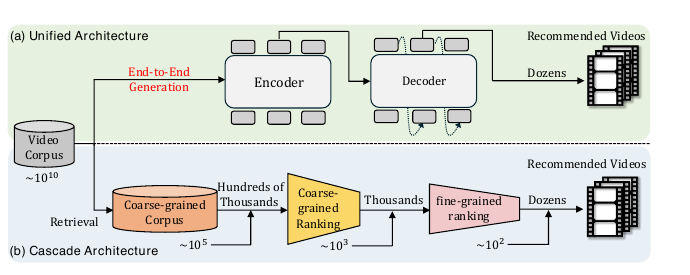
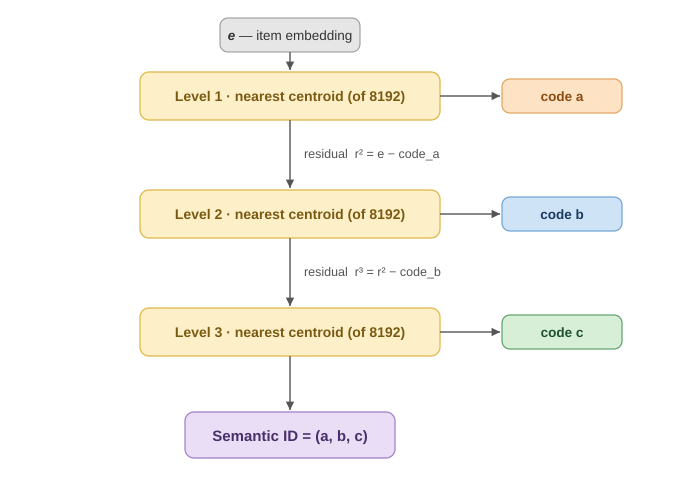
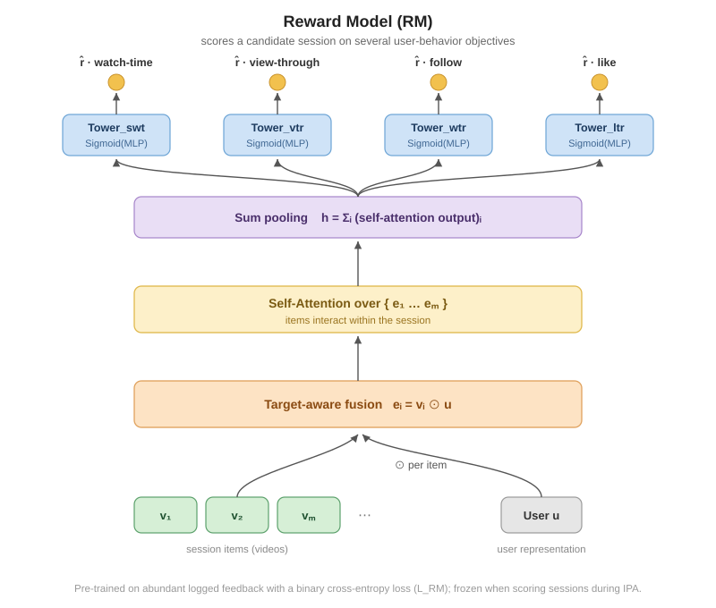
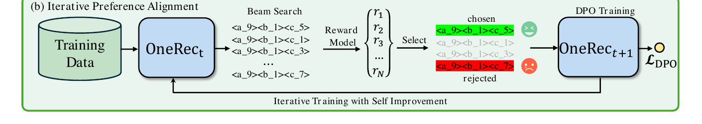
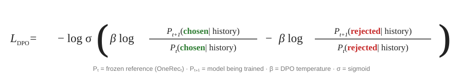

+++
date = '2026-07-29T10:00:00-07:00'
draft = false
title = 'OneRec（快手）详解和思考：一个生成式推荐模型统一召回与排序'
tags = ['onerec', '推荐系统', '生成式推荐', 'semanticid', 'moe', 'dpo', '偏好对齐', 'llm', '快手', 'ai学习']
summary = """
  *一个生成式推荐模型，代替整套"召回→排序"流程；一次生成一整个 session；再用 Reward Model 驱动的 Self-Improving DPO 循环做 Preference Alignment。*
"""
+++

*一个生成式推荐模型，代替整套"召回→排序"流程；一次生成一整个 session；再用 Reward Model 驱动的 Self-Improving DPO 循环做 Preference Alignment。*

论文：**[OneRec: Unifying Retrieve and Rank with Generative Recommender and Preference Alignment](https://arxiv.org/abs/2502.18965)**（Deng et al., 快手, 2025）

---

## TL;DR

推荐系统通常是**多阶段**流程：召回 → 粗排 → 精排。每一段都有一个独立的模型，而上一段的质量，就是下一段的天花板。像 **TIGER**（[我之前的这篇](../tiger-generative-retrieval/)）这样的生成式召回工作，把召回变成了 LLM 式的 **next-Semantic-ID 预测**——但它只重写了**召回**这一段。

**OneRec** 更彻底：把**整条**推荐链路收进**一个 encoder–decoder Transformer**。它读用户的观看历史，**直接生成下一个 session 的视频列表**——召回和排序合并成同一次自回归解码。三个关键设计：（1）**稀疏 MoE（Mixture-of-Experts）** decoder，让模型能便宜地 scale up；（2）**Session-wise 生成**——一次产出 5~10 个视频的完整列表，而不是一次一个 item；（3）**IPA（Iterative Preference Alignment，迭代式偏好对齐）**——用 Reward Model + DPO 的循环，教模型什么样的 session 用户真的爱看。上线快手主 feed（数亿 DAU），A/B 测试**总观看时长 +1.68%**——在工业级规模上，这对生成式推荐是一个相当大的胜利。

它更是一次很有意思的尝试：用**一个**端到端训练的模型，替掉**整套**多阶段推荐栈——这背后是行业更大的趋势：**少一些人工设计的 pipeline 结构，多给模型一些自由，换取更高的天花板。**

## 问题在哪

**多阶段推荐栈。** 要在 10¹⁰ 量级的视频库里高效推荐，工业推荐系统会把候选一层层漏斗下来，每一层更重、更准：召回（~10⁵ 个候选）→ 粗排（~10³）→ 精排（~10²）。OneRec 把这一整套换成一次 encoder→decoder：

*OneRec 的统一生成（a）vs 传统多阶段推荐栈（b）。[论文](https://arxiv.org/abs/2502.18965) Figure 1。*

多阶段栈有两个结构性的问题：

- **每一段都是下一段的上限。** 排序只能对召回送上来的东西重新排一遍；被前面丢掉的，就永远回不来了。而且各阶段是独立训练的，误差会层层累积。
- **生成式推荐只用在了召回上。** TIGER 这类方法把**召回**重新定义成生成 item ID，但生成之后，还是要接一整套下游的排序栈。

**OneRec 的思路：用一个生成式模型替掉整个推荐栈。** 给定用户历史，**直接生成**最终的 session 视频列表——不再有独立的召回、粗排、精排模型。召回和排序，就是同一次自回归解码。

## 方法详解

OneRec 有几个部分：**item tokenization**（把每个视频变成一个短短的 Semantic ID 元组）、**生成模型**（读用户历史，解码出下一个 session）、以及**迭代式 DPO 偏好对齐**（IPA）——用一个 **Reward Model** 来刻画用户到底喜欢什么。

### Step 1 —— 把视频 tokenize 成 Semantic ID（balanced K-means）

和 TIGER 一样，OneRec 给每个 item 一个 **Semantic ID**：一个短 codeword 元组，相似的 item 共享前缀。每个视频先是一个**多模态 embedding** `e`，再被量化成 `L = 3` 个 token（每层一个）。

但**量化器不同**。TIGER 训练并使用了 **RQ-VAE**；OneRec 发现 RQ-VAE 产出的 **code 分布严重不均衡**——少数 code 吸走了大部分 item，而大部分 code 几乎是空的（所谓 *"hourglass phenomenon"*，沙漏现象）。这对生成模型很不友好：它希望概率能均匀铺在一个被充分利用的词表上。

所以 OneRec 换成了 **residual balanced K-means**（残差式均衡 K-means）。每一层把 item 聚成 `K = 8192` 个簇，而且**加了约束：每个簇装的 item 数量必须一样多**（`w = |V| / K`）。一个 item 的 Semantic ID，就是逐层最近的那些质心（centroid）的序号：

*用 residual balanced K-means 分配 Semantic ID（示意图；论文里是 Algorithm 1 的伪代码）。*

3 层各有自己的 8192 条 codebook，所以只用 `3 × 8192` 个 codeword embedding，就能表示 `8192³ ≈ 5.5×10¹¹` 个 item。一个视频，从此就是**3 个 token**。

### Step 2 —— Session-wise 生成（而不是 point-wise）

传统的 point-wise 推荐模型只预测"下一个视频"。OneRec 的 **session-wise 生成**直接生成一个**高价值 session**——一次用户请求返回的那 5~10 个视频——于是模型同时学到了**放哪些视频**，以及**按什么顺序放**用户才喜欢。

训练目标是从日志里挖出来的**高价值 session**：比如用户看了 ≥5 个视频、总观看时长超过某个阈值、并且有互动（点赞 / 收藏 / 分享）。模型学着复现这些好 session（`m = 5` 个目标 item）。

### Step 3 —— 生成下一个 session（encoder–decoder + MoE）

统一推荐模型是一个 **encoder–decoder Transformer**：

*OneRec 的 encoder–decoder（decoder 里是 MoE），[论文](https://arxiv.org/abs/2502.18965) Figure 2a。每个视频是 3 个 semantic token（`<a_·><b_·><c_·>`），decoder 一个一个往外吐。*

- **Encoder** 读用户行为序列 `H_u`（看过 / 点赞 / 关注 / 分享的视频，最多 `n = 256` 个）。
- **Decoder** 逐 token 生成目标 **session**（`L_NTP` 就是 Next-Token-Prediction loss），再把每 3 个 token 一组映射回视频。
- **Decoder 里的稀疏 MoE** 把 FFN 换成了 `N_MoE = 24` 个 expert，router 每个 token 只激活 `K_MoE = 2` 个。这样只 scale 模型**容量**，不 scale **推理成本**——线上服务时**只有约 13% 的参数是激活的**。而且和 LLM 的 Scaling Law 一致：作者发现 OneRec 越大，推荐效果越好。

### Step 4 —— 用 Reward Model 和 DPO 做迭代式偏好对齐

Next-Token-Prediction 训练只教会模型**模仿**好的 session。要让它去找**更好的** session，OneRec 从 LLM 的 post-training 里搬来了 **DPO**（Direct Preference Optimization）。但推荐场景有个特有的坎：

> 在 NLP 里，人工标注可以给出"回答 A 优于回答 B"这样的 pair。但在推荐系统里，**每一次浏览请求只会给用户展示一个列表**——你永远看不到同一个请求的"好版本"和"坏版本"并排摆在一起。**偏好 pair 在日志里根本不存在。**

OneRec 的解法：训一个 **Reward Model** 来替代真实的用户反馈，然后用它在循环里不断改进生成模型。

#### Reward Model

Reward Model（RM）给一个候选 session 打分，而且是**多目标同时打分**——它很像传统推荐系统里常用的多任务排序模型（Multi-task Ranking Model）。对于 session `S = {v₁, …, vₘ}` 和用户 `u`：先做 **target-aware** 的表示融合（`eᵢ = vᵢ ⊙ u`，比如对用户行为序列做 target attention），再让这些 item **通过 self-attention 相互交互**，然后 **sum-pooling** 成一个向量，最后过**四个 `Sigmoid(MLP)` 塔**——每个塔一个目标：**观看时长（swt）、完播（vtr）、关注（wtr）、点赞（ltr）**。RM 用海量的日志反馈、以 binary cross-entropy loss 预训练。

*Reward Model，依据[论文](https://arxiv.org/abs/2502.18965) 3.3.1 节（论文里没有这张图）。*

论文没有说最终的总 reward 怎么算，但很可能是各个目标预测值的某种组合（比如加权求和）。

#### 用 DPO 做迭代式偏好对齐

有了 RM，OneRec 就能自我迭代改进：生成候选 session → 变成偏好 pair → 用 DPO 训练 → 拿改进后的模型再来一轮：

*Iterative Preference Alignment（[论文](https://arxiv.org/abs/2502.18965) Figure 2b）。*

**生成偏好 pair。** 对每个用户，用当前模型 `OneRec_t` 做推理，**beam search** 出 `N = 128` 个候选 session，再用 Reward Model 打分。**reward 最高的那个当 *chosen***，**最低的那个当 *rejected***——一个（chosen, rejected）偏好 pair 就有了。

**迭代式 DPO 训练。** 每一轮训一个新模型 `OneRec_{t+1}`，从当前的 `OneRec_t` 初始化——而 `OneRec_t` 随即被**冻住，当作 reference model**。对每个偏好 pair，**DPO** loss 推着 `OneRec_{t+1}` 提高 *chosen* session 的概率、压低 *rejected* 的概率，而且两者都是**相对于冻住的 reference** 来衡量的：

关键在于，OneRec **并不是只优化 DPO**，而是训练组合 loss：**`L = L_NTP + λ·L_DPO`**——保留 Next-Token-Prediction loss，让模型在学偏好信号的同时，仍然**模仿**好的 session（纯 DPO 会让模型漂走，生成出不合法的 session）。

整个过程是**迭代**的：`OneRec_{t+1}` 成为下一轮的 reference model，重新生成候选和偏好 pair，循环好几轮（`OneRec_1 → OneRec_2 → … → OneRec_T`）——每一代都从上一代**自己的输出**里 bootstrapping，也就是**自我提升（self-improvement）**。为了控制训练成本，只有 **`r_DPO = 1%`** 的训练样本用 `L_DPO`（其余的走普通的 `L_NTP`）。实验显示，**1% 的 DPO 采样比例**平均能拿到**最优效果的 95%**，而算力开销远小于更高的比例。

## 实验与结果

在快手的大规模工业数据集上做离线评测，加上线上 A/B 测试。指标：观看侧 **swt**（session 观看时长）和 **vtr**（完播）；互动侧 **wtr**（关注）和 **ltr**（点赞）。Baseline 覆盖了判别式 point-wise 模型（SASRec、BERT4Rec、FDSA）、生成式 point-wise 模型（TIGER），以及一堆 DPO 变体（IPO、cDPO、rDPO、CPO、simPO、S-DPO）。

主要结论：

- **Session-wise 生成打败 point-wise 生成。** OneRec-1B（不带 IPA）比 TIGER-1B 高 **+1.78% max swt**、**+3.36% max ltr**——说明生成一个连贯的列表，确实优于逐点预测。
- **一点点偏好对齐，收益巨大。** 只用 **1% 的 DPO** 数据，OneRec-1B+IPA 在 OneRec-1B 之上又拿到 **+4.04% max swt** 和 **+5.43% max ltr**，而且 **IPA 优于所有其他 DPO 变体**。
- **它像 LLM 一样 scale。** 模型从 0.05B 涨到 1B，精度稳定提升（0.05B→0.1B 提升 +14.45%，之后每一档再涨 5~6%）——而 MoE 设计正是让这件事**付得起钱**的关键。注意：1B 用 LLM 的标准看，还是很小。
- **线上 A/B（快手主 feed，数亿 DAU）：** OneRec-1B+IPA 带来 **+1.68% 总观看时长**和 **+6.56% 平均播放时长**——在这个体量上，是很实在的收益。IPA 是最后那一脚，而且收益随模型变大而增长：

| 模型 | 总观看时长 | 平均播放时长 |
|:---|:---:|:---:|
| OneRec-0.1B | +0.57% | +4.26% |
| OneRec-1B | +1.21% | +5.01% |
| **OneRec-1B + IPA** | **+1.68%** | **+6.56%** |

*[论文](https://arxiv.org/abs/2502.18965) Table 2：线上 A/B 中相对快手现有多阶段推荐系统的绝对提升。*

## 我的一些想法

### OneRec 的优势

- **一个模型，没有多阶段栈的误差累积。** 把召回和排序统一起来，去掉了"每段都是下一段天花板"的瓶颈，也省掉了维护好几个独立训练模型的负担。更重要的是，OneRec 证明了这样一个统一的生成式推荐模型**能在工业级规模上真正上线，并且拿到实打实的收益**。
- **Session-wise 是对的抽象层次。** 推荐的输出本来就是一个**列表**，不是一个 item。直接生成列表——把"选什么"和"怎么排"一起学——效果好于传统的 point-wise 推荐。
- **MoE 让 scaling 变得可行。** 拿到 LLM 式的 scaling 收益，同时推理只激活约 13% 的参数——正是这一点，让"一个很大的生成式推荐模型"从研究玩具变成快手真能扛得住的线上服务。
- **DPO 式的自我提升对齐，在推荐系统里是有效的。** 认清"推荐日志里拿不到偏好 pair"这个事实，然后用 Reward Model 驱动的自我提升循环把它绕过去，是非常漂亮的创新！它把 LLM 的 post-training 移植进推荐系统，而且真的带来了性能提升。

### OneRec 的缺点

- **服务成本和延迟。** 在自回归 decoder 上做 beam search（size 128），比传统的"召回再排序"链路重得多。要靠 KV-cache 解码、float16、MoE 稀疏化，才勉强跑得动。
- **Reward Model 成了新的天花板。** IPA 优化的是 **RM 分数**，不是真实用户。RM 的任何偏差（比如过度偏爱观看时长）都会被放大进策略里——这是典型的 reward hacking 风险。
- **复杂度上升。** 相比传统推荐系统，balanced K-means tokenization + MoE encoder-decoder + Reward Model + 迭代 DPO 循环，是一堆新增的活动零件。
- **到底是 scale up 的功劳，还是统一架构的功劳？** OneRec 用一个 scale up 之后的统一模型拿到了显著收益，但也可以争辩说：把传统的召回和排序模型分别 scale up，说不定也能拿到其中一部分收益。

### 大方向

- **这篇论文为什么重要。** TIGER 让生成式**召回**变得有竞争力；OneRec 是最早做到**一个生成式模型**、在真实的大规模生产系统里**打败一套成熟且调优充分的完整推荐栈**（召回 + 排序）的工作之一。这正是这个领域一直在等的里程碑——它展示了生成式推荐这个新方向的巨大潜力。
- **行业趋势。** "推荐正在变成一个 LLM 问题"这个论断，在这里走到了它的逻辑终点：item 即 token，整条链路就是一个序列模型，用 Scaling Law + MoE 换容量，用 RLHF 式的偏好对齐（DPO + Reward Model）换质量。随着推理成本继续下降，可以预期推荐栈里更多的部分会塌缩进这样的生成式结构里——而自我提升的对齐循环，很可能成为推荐系统里一项激动人心的关键技术！
- **把推荐模型 scale up。** OneRec 只是其中一条路，还有很多值得探索。OneRec-1B 按 LLM 的标准还很小，随着 LLM 推理越来越便宜，把模型继续做大，是一条很有希望拿到更大收益的路。

---

#ai #推荐系统 #生成式推荐 #onerec #semanticid #moe #dpo #偏好对齐 #llm #快手 #人工智能 #ai学习 #大模型

If you like this post, consider star [the repo](https://github.com/sleepingbear-ai/sleepingbear-ai.github.io).
