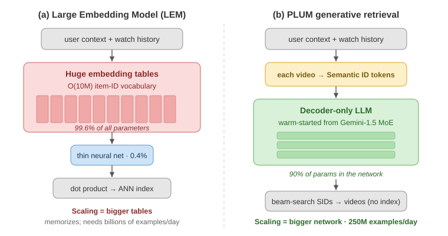
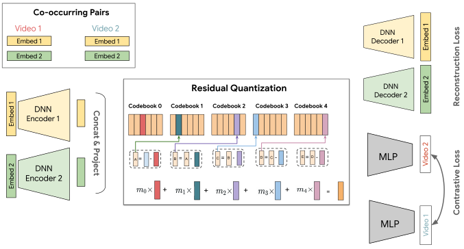

+++
date = '2026-08-04T10:00:00-07:00'
draft = false
title = 'YouTube PLUM 解释和思考：把 Gemini LLM 改造成工业级生成式召回模型'
tags = ['plum', '推荐系统', '生成式推荐', '生成式召回', 'semanticid', 'rqvae', 'llm', 'gemini', 'youtube', 'googledeepmind', 'ai学习']
summary = """
  *PLUM（Google DeepMind & YouTube）把一个预训练好的 Gemini LLM 改造成了线上推荐模型：先把每个视频 tokenize 成 Semantic ID，把这些 ID 加进 LLM 的 vocabulary，继续预训练让 LLM 学会"视频"这个新 modality，最后 fine-tune 它直接生成下一个视频的 ID。*
"""
+++

*PLUM（Google DeepMind & YouTube）把一个预训练好的 Gemini LLM 改造成了线上推荐模型：先把每个视频 tokenize 成 Semantic ID，把这些 ID 加进 LLM 的 vocabulary，继续预训练让 LLM 学会"视频"这个新 modality，最后 fine-tune 它直接生成下一个视频的 ID。*

论文：**[PLUM: Adapting Pre-trained Language Models for Industrial-scale Generative Recommendations](https://arxiv.org/abs/2510.07784)**（He et al., Google DeepMind & YouTube, 2025 年 10 月）

---

## TL;DR

PLUM（YouTube & DeepMind）把一个通用 **Gemini LLM** 改造成**生成式召回模型（generative retrieval）**，并真正上线服务数十亿用户。整体流程：

1. **Item tokenization** —— 给每个视频一个 **Semantic ID**（token tuple），由改进版 RQ-VAE 生成，论文称之为 **SID-v2**（SID-v1 见我之前的 [TIGER 解读](../tiger-generative-retrieval/)）。
2. **继续预训练（CPT，Continued Pre-Training）** —— 把 SID token 加进 Gemini LLM 的 vocabulary，在"用户观看历史 + 视频元数据"各占一半的数据上继续预训练，让模型把视频 SID 学成一个和文本对齐的新 **modality**。
3. **推荐系统 fine-tuning（SFT）** —— 把 LLM 改造成推荐模型：让 LLM 自回归地生成用户下一个会互动的视频的 SID（Next SID Prediction），loss 按推荐系统 reward 加权。

结果：它打赢了一个**被高度优化过的**传统 embedding table 召回模型，而训练量只有 **每天约 2.5 亿条样本（对方是几十亿条）**，算力 **不到 0.55x FLOPs**。

这是一个重要的结果：PLUM 给出了一条改造通用 LLM 去解决推荐问题的可行路径，同时也是最早在 YouTube 这个量级上线的生成式召回推荐系统之一。

## 问题在哪：推荐系统里的召回

**输入：** 用户的观看历史 + 推荐上下文。
**输出：** 从十亿量级的视频库里，选出几百个用户可能感兴趣的候选视频。

过去十年，主流答案一直是 **LEM（Large Embedding Model，大 embedding 模型）**：给每个 item（视频）ID 学一个 embedding，再给用户生成一个 embedding，然后拿用户 embedding 去 item embedding 的 **ANN（近似最近邻）索引**里检索。论文提到，YouTube 线上召回模型的 embedding 层 vocabulary 规模是 `O(10M)`（即 `O(10M)` 个 item embedding），占了**模型参数的 99.6%**——剩下的整个神经网络只有 **0.4%**。

*参数预算就是全部故事：LEM 靠把查找表做大来 scale，PLUM 靠把网络做大来 scale。（本文绘制，依据论文 3.1.1 节。）*

这个失衡正是论文点出的核心局限：LEM 非常擅长**记忆**用户–item 的交互，但参数全堆在 embedding table 上，就压制了更深、更复杂的网络本可以带来的收益。它的 scaling 方式是**把表加大**——而 LLM 的 scaling 方式是**把网络加大**，在紧凑的 token 上做推理。前者是加行数，不是加推理能力。

LLM 的成功催生了 **生成式推荐（Generative Recommendation）** 这个行业趋势——用 LLM 来构建推荐模型。LLM 的世界知识和推理能力，有可能带来更聪明、更相关的推荐。但把 LLM 改造成推荐模型并不容易。

### 为什么不能直接拿一个现成的 LLM 来做推荐？

最主要的困难是 **domain gap（领域差距）**：LLM 没有在用户行为数据和目标 item 库上预训练过，所以它很难从用户行为里推断偏好，也很难判断 item 质量的细微差别。结果就是，直接把现成 LLM 用于推荐，即使在很小的公开数据集上也存在持续的效果差距（[Hou et al., 2024](https://arxiv.org/abs/2305.08845)）。

**PLUM 的答案：** 教会一个预训练 LLM 一个新的 modality——**带语义的视频 ID**——以及领域知识。把输入（用户观看历史和上下文）表示成视频 token 和文本 token 混合的序列，让 LLM 基于这个序列**生成下一个视频的 ID** 作为推荐结果。

## 方法详解

*PLUM 的流程（本文绘制，概括论文第 2 节）。*

### Step 1 —— 把每个视频 tokenize 成 Semantic ID（SID-v2）

Semantic ID 是从 item 内容里导出的一个离散 codeword tuple，由 **RQ-VAE（Residual-Quantized VAE）** 生成：把 item 编码成一个稠密向量，用 codebook 量化，取残差，再用下一层 codebook 量化，如此往复。每一层选中的 codeword 就是 ID 的一个 token。（RQ-VAE 的详细解释见我的 [TIGER 解读](../tiger-generative-retrieval/)。）

PLUM 在这个配方上做了几处改动：

*SID-v2 模型：双 encoder、残差量化，加上重建 loss + 对比 loss。（[论文](https://arxiv.org/abs/2510.07784) Figure 1，He et al., 2025。）*

* **融合多模态输入。** 一个视频的语义存在于标题、画面和音频里。TIGER 只量化了**单个**（基于文本的）内容 embedding；PLUM 输入一组多模态 embedding `{x_1 … x_M}`，各自用独立 encoder 编码，然后拼接并投影成一个融合向量 `z` 再做量化。

* **多分辨率 codebook。** TIGER 每一层用一样大的 codebook，这其实很浪费：越深的层编码的是越小、越低熵的残差，却分到同样多的 codeword，导致大部分 SID 空间稀疏空置。OneRec 注意到了类似问题，改用 **balanced K-means** 而不是 RQ-VAE 来生成 SID（详见我的 [OneRec 解读](../onerec/)）。PLUM 的做法是让每层 codebook 按几何级数缩小——`2048 / 2^(l−1)`——这样第一层最有区分度，整个 SID 也更紧凑高效。

  与之配套的是 **progressive masking（渐进式掩码）**，在训练中强制这个层级结构：

  `semantic_id_in_training = ProgressiveMasking(semantic_id from RQ-VAE)`

  **Progressive masking** 随机保留 SID 的一个前缀、掩掉其余部分，训练中只用这个前缀作为 Semantic ID。比如一个 4 层的 SID `(A5, B25, C12, D8)` 可能被截断成 `(A5, B25)`。这迫使 Semantic ID 的靠前层级**自己就要有意义**，从而在残差量化中形成更严格、也更可解释的层级。这和神经网络训练里的 **Dropout** 很像：随机丢掉一部分表示，逼着每一部分都自己携带有用信号。

* **共现对比正则（co-occurrence contrastive regularization）。** 在 TIGER 里，SID 是纯内容 embedding 的量化结果。为了让 SID 更贴近用户行为，PLUM 用一个对比 loss 把协同过滤（collaborative filtering）信号直接注入量化器，鼓励模型给**在同一次观看 session 中共现**的视频生成相近的 SID。

* **三个训练 loss。** RQ-VAE 模型端到端训练，最小化 `L = L_recon + L_rq + L_con`：
    * **`L_con` —— 对比 loss：** 上面说的共现正则，PLUM 新增的部分。
    * **`L_recon` —— 重建 loss：** 把量化后的 SID 解码回原始输入 embedding，让量化的信息损失最小。
    * **`L_rq` —— 量化（codebook + commitment）loss：** 训练 codebook 和 encoder 达成一致，让每一层的 codeword 忠实表示它的残差。（`L_recon` 和 `L_rq` 是标准 RQ-VAE loss，公式和详细解释见我的 [TIGER 解读](../tiger-generative-retrieval/)。）

### Step 2 —— 继续预训练（CPT）：教会 LLM 一个新 modality

一个通用的 Gemini LLM 并不懂 YouTube 的推荐领域知识——它只是一个带自己文本 vocabulary 的语言模型。那怎么教会它？PLUM 的做法很巧妙：**把视频的 Semantic ID 扩进 LLM 的 vocabulary**。

但只是把 SID token 加进 vocabulary 是不够的，还得**教会 LLM 这些 SID token 的含义**——也就是让它们和已有的文本 token 对齐。PLUM 的办法是在合成的「视频 SID + 文本 token」序列上继续做 **next-token-prediction** 预训练，数据 50/50 混合：

* **用户行为数据** —— 观看历史，附带额外特征。
* **视频元数据语料** —— 把 SID 和它的文本绑定起来的自然语言句子，取自视频标题、描述、字幕和频道名。

两者都按下面的 schema 序列化成 token 序列：

| Schema | 例子 |
|---|---|
| 用户行为 | `watch_history = <sid_1> <channel_name> <watch_ratio> <watch_time> <hours_since_final_watch> <sid_2> <channel_name> … <sid_n>` |
| SID + 视频标题 | `Video <sid> has title (en): <video_title>` |
| SID + 视频话题 | `The topics in video <sid> are: <topics>` |

*继续预训练使用的 schema 示例（[论文](https://arxiv.org/abs/2510.07784) Table 1）。*

训练规模：**100 万步，batch size 16，约 2600 亿 token。**

结果是一个 SID token 和文本处在同一表示空间里的 LLM——而且值得注意的是，它**保留了通用 LLM 能力**，可以在 SID 上做 **few-shot in-context learning**：给它一个 SID 和一段任务描述，它能合理地把句子补全。

### Step 3 —— 监督微调（SFT）做生成式召回

CPT 给出的是一个"看得懂 SID"的模型；SFT 把它专门化成召回模型：**给定用户和上下文，生成他下一个会互动的视频的 SID。**

*生成式召回：decoder-only LLM 读入 prompt，生成下一个视频的 Semantic ID。（[论文](https://arxiv.org/abs/2510.07784) Figure 2，He et al., 2025。）*

输入 prompt 是多种 modality 的混合——交错的 SID token、文本特征，以及为数值特征定制的 token。特别地，这里加入了 CPT 阶段没有的**实时上下文**。模型学习的是：给定用户上下文和历史，预测日志里**被点击视频**的 SID token。

Loss 是标准的自回归最大似然目标（在目标 SID 的各个 token 上），但**按 reward 加权**：

`r(user, v_click)` 是为每次点击手工设计的 reward——所以一次带来满意观看的点击，权重高于一次误触。训练样本按这个 reward 权重采样，然后在 loss 里等权重对待。

**线上服务时**，PLUM 用 **beam search** 从模型解码出多个 SID，每个 SID 映射回一个真实视频，作为召回候选。原则上模型可能**幻觉**出一个不对应任何视频的 SID，但 SFT 之后幻觉率 **< 5%**——真实存在但可控。

而且没有 ANN 索引：**模型本身就是索引。**

## 实验与结果

**被评测的模型**是一个 **900M 激活参数的 MoE（Mixture-of-Experts）**（总参数约 4.2B）LLM，来自 Gemini-1.5 家族，热启动后在 YouTube 数据上做 CPT 和 SFT，覆盖长视频（LFV）和 Shorts 两个场景。

**对比一个被高度优化过的线上 Transformer LEM baseline**（每个数字是 PLUM ÷ LEM）：

| 指标 | 长视频（LFV） | Shorts |
|:---|:---:|:---:|
| 有效 vocabulary 规模 | 2.60x | 13.24x |
| CTR | 1.42x | 1.33x |
| 每次曝光观看时长 | 0.72x | 1.13x |
| 每次曝光完播比例 | 1.32x | 1.03x |

*[论文](https://arxiv.org/abs/2510.07784) Table 2。"有效 vocabulary 规模" = 覆盖 95% 曝光所需的不同视频数量。*

最亮眼的是**有效 vocabulary 规模**——Shorts 上 13x。PLUM 推荐的视频覆盖了库里**宽得多**的一片区域，说明它的泛化更好；而 baseline LEM 明显更集中在热门视频上。两个场景的 CTR 也都有明显提升。

**线上 A/B 测试**（在最好的现有召回模型之上叠加 PLUM 召回，配额对齐，记为 LEM+）：

| 指标 | 长视频（LFV） | Shorts |
|:---|:---:|:---:|
| 活跃用户 | +0.07% | +0.28% |
| Panel CTR | +0.76% | +4.96% |
| 播放量 | +0.80% | +0.39% |
| 满意度 | +0.06% | +0.39% |

*[论文](https://arxiv.org/abs/2510.07784) Table 3。*

绝对数字看起来很小，但在 YouTube 的体量上并不小。它们说明：在一个已经被高度优化的系统之上，PLUM 仍然带来了**增量价值**。

**训练效率。** 900M MoE 每天训练约 **2.5 亿条样本**；LEM 每天要训练**几十亿条**。尽管 PLUM 的稠密参数是 LEM 的 100 倍，它的总训练成本却相当——因为收敛快得多，只用了 **不到 0.55x 的 FLOPs**。

**SID-v2 消融实验** —— 每一项改进都有用，其中共现 loss 最关键：

| SID 模型 | SID 唯一性 | Video Recall@10 |
|:---|:---:|:---:|
| SID-v1（baseline） | 94.0% | 12.3% |
| **SID-v2（完整）** | **96.7%** | **14.4%** |
| − 多分辨率 codebook | 94.8% | 13.2% |
| − 多 embedding | 96.9% | 12.8% |
| − 共现 loss | 91.8% | 12.6% |

*[论文](https://arxiv.org/abs/2510.07784) Table 4。*

**CPT 和"用预训练 LLM 初始化"到底有没有用？**

回忆一下：

**`PLUM 训练 = 用预训练 LLM 初始化 + 继续预训练（CPT） + 监督微调（SFT）`**

四个变体的评测结果，架构都是同一个 MoE-900M，指标是第 8 天的 Recall@10：

| 模型 | 预训练 LLM | CPT | Recall@10 |
|:---|:---:|:---:|:---:|
| R1 | 否 | 否 | 0.19 |
| R2 | 是 | 否 | 0.23 |
| CR1 | 否 | 是 | 0.27 |
| **CR2（PLUM）** | **是** | **是** | **0.28** |

*[论文](https://arxiv.org/abs/2510.07784) Table 5。*

这张表值得仔细读，它是论文里最有价值、也最有意思的一张：

* **CPT 的价值。** R1 与 CR1（或 R2 与 CR2）之间差距很大。而且一个 CPT checkpoint 可以复用到很多下游 fine-tuning 任务上。
* **预训练 LLM 的价值。** 无论有没有 CPT，从预训练 LLM 初始化都稳定优于随机初始化。这个优势可能来自预训练 LLM 的自然语言知识。
* **两者叠加时收益递减（CR1 → CR2）。** 在已经做了 CPT 的情况下，再用预训练 LLM 初始化只带来 **+0.01** 的 Recall@10（0.27 → 0.28）；而在没有 CPT 时（R1 → R2）是 **+0.04**。也就是说，一旦 CPT 把模型适配到了领域数据上，预训练权重的贡献就小很多——**CPT 已经把 LLM 初始化能带来的大部分东西给学到了**。这个观察挺有意思，因为我们本来会期待 LLM 里的通用知识能帮上更多忙。一个可能的原因是，这里用的 LLM 还是偏小。

**Scaling 研究。** 在 MoE-110M / 370M / 900M / 3B 上，训练 loss 在 Iso-FLOPS 下呈漂亮的 **幂律（power law）**，召回 Recall@10 也随算力持续提升；算力预算越大，最优模型尺寸越大。

有一个作者自己点出的意外：**MoE-3B 在测试的训练预算下没有打赢 MoE-900M**。他们归因于训练设置——所有模型分到同样的训练资源、batch size 按打满 HBM（高带宽显存）来定，这就使得大模型的 batch size 更小，MoE-3B 只训练了 **0.57 个 epoch** 的数据。他们给出的教训是：**compute-optimal 的训练需要训练数据和模型规模一起放大。**

## 我的一些想法

### 优势与启发

* **一套把 LLM 改造成推荐模型的框架。** PLUM 给出了一个有效的方法把预训练 LLM 改造成生成式推荐模型。而 *tokenize → 继续预训练 → fine-tune* 这个结构，其实是一份**可迁移的 playbook**：把 LLM 引入任何一个多模态领域去解决领域任务，都可以照着做——不只是生成式推荐。

* **更好的 Semantic ID。** 几处 tokenizer 上的创新共同带来了更高质量的 Semantic ID：注入协同过滤信号的**共现对比 loss**、**多分辨率 codebook**、**progressive masking**。好的 Semantic ID 是任何生成式推荐系统的地基。

* **训练效率改变了经济账。** 每天少用约 20 倍的训练样本，才让"用 LLM 做推荐"在这里变得负担得起。这是"item token 架构比大 embedding table 更便宜"的一个有力论据。

* **一个真正部署上线的 LLM 推荐系统。** PLUM 把预训练 Gemini LLM 变成了线上推荐 LLM，并在 YouTube 的量级上部署。作为最早在生产环境部署的生成式推荐 LLM 之一，这是一个令人兴奋的工程成就。

### 不足与可能的后续工作

* **Serving 和基础设施成本。** 这不是 PLUM 独有的问题，但 LLM 推理 + beam search 的线上成本，可能仍然高于传统 LEM + ANN 检索。

* **长视频上的每次曝光观看时长下降（0.72x）。** 召回更多样、更长尾的视频，似乎在长视频上带来了更短的观看。一个可能的补救是：在 SFT 的 reward 和采样里给观看时长更高的权重。

* **省内存的 SFT（LoRA / QLoRA）。** PLUM 的 SFT 是全参数微调。值得研究的是，省内存的方法（[LoRA](https://arxiv.org/abs/2106.09685)、[QLoRA](https://arxiv.org/abs/2305.14314)）在训练成本和效果之间是否有更好的权衡。

* **Scaling law 和更大的 LLM。** MoE-3B 没能打赢 MoE-900M。后续工作如果能解决这个 scalability 问题、把更大的 LLM 用进推荐，或许能把更多"LLM 的魔法"带进生成式推荐。

### 大方向

**为什么重要。** 随着 LLM 越来越强——吸收多模态知识、推理能力不断提升——把它们用到推荐上潜力很大。PLUM 是最早成功把一个预训练的通用 LLM 改造成推荐 LLM、并在 YouTube 量级完整部署的系统之一。这是一个非常了不起的工程成就。

更重要的是，PLUM 给出了一套**可复制的方法论**——**tokenize → 继续预训练 → fine-tune**——把通用 LLM 变成某个领域的专用 LLM。这个配方的价值，可能远远超出生成式推荐本身，对各种领域专用 LLM 应用都是重要贡献。

**行业趋势。** 由 LLM 和 Scaling Law 驱动的生成式推荐，已经是行业的一个重要方向。**[TIGER](../tiger-generative-retrieval/)**、**[OneRec](../onerec/)**、**PLUM** 这些开创性的系统，为理解和继续构建这个方向打下了很好的基础。而随着 LLM 越来越强、越来越便宜，生成式推荐接下来的发展会非常值得期待！

## 参考文献

1. **PLUM**：[PLUM: Adapting Pre-trained Language Models for Industrial-scale Generative Recommendations](https://arxiv.org/abs/2510.07784)（He et al., Google DeepMind & YouTube, 2025 年 10 月）
2. Hou et al. [Large Language Models are Zero-Shot Rankers for Recommender Systems](https://arxiv.org/abs/2305.08845)，ECIR 2024
3. Hu et al. [LoRA: Low-Rank Adaptation of Large Language Models](https://arxiv.org/abs/2106.09685)，ICLR 2022
4. Dettmers et al. [QLoRA: Efficient Finetuning of Quantized LLMs](https://arxiv.org/abs/2305.14314)，NeurIPS 2023
5. 我的解读：[TIGER（生成式推荐的经典论文）：解释和思考](../tiger-generative-retrieval/)
6. 我的解读：[OneRec（快手）解释和思考：一个生成式推荐模型统一召回与排序](../onerec/)

---

#ai #推荐系统 #生成式推荐 #生成式召回 #plum #semanticid #rqvae #llm #gemini #youtube #人工智能 #ai学习 #大模型

If you like this post, consider star [the repo](https://github.com/sleepingbear-ai/sleepingbear-ai.github.io).
