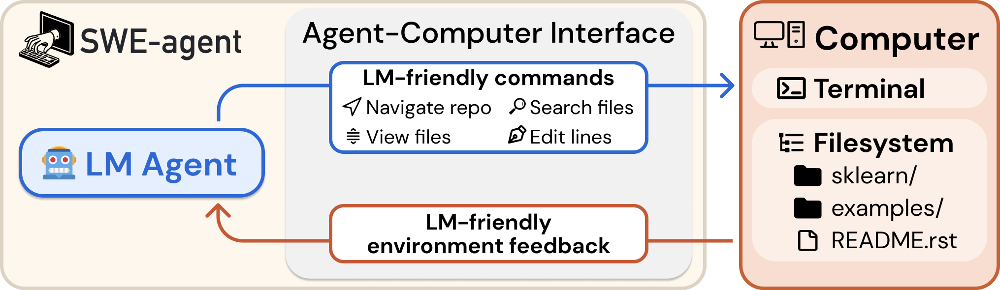
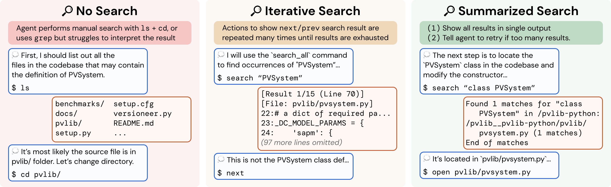
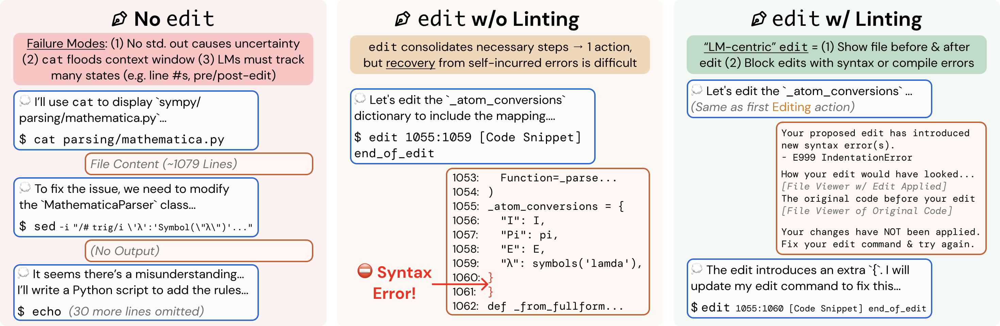

+++
date = '2026-08-25T10:00:00-07:00'
draft = false
title = 'SWE-agent 解释和思考：如何有效设计AI Agent'
tags = ['ai', 'aiagents', 'codingagent', 'sweagent', 'swebench', 'aci', 'llm', 'aicoding', '人工智能', 'ai学习', 'ai编程', '大模型']
summary = """
  *SWE-agent（Princeton University）是 Coding Agent 领域的经典论文。它提出 Agent-Computer Interface（ACI），解释了为什么工具设计、context management 和 guardrails 会直接影响 Agent 的能力，并在不改变底层 LLM 的情况下，把 SWE-bench Lite 的问题解决率从 11.0% 提升到 18.0%。*
"""
+++

*SWE-agent（Princeton University）是 Coding Agent 领域的经典论文。它提出 Agent-Computer Interface（ACI），解释了为什么工具设计、context management 和 guardrails 会直接影响 Agent 的能力，并在不改变底层 LLM 的情况下，把 SWE-bench Lite 的问题解决率从 11.0% 提升到 18.0%。*

论文：**[SWE-agent: Agent-Computer Interfaces Enable Automated Software Engineering](https://arxiv.org/abs/2405.15793)**（Yang et al., Princeton University, NeurIPS 2024）

---

## TL;DR

SWE-agent 是一篇关于 **Coding Agent** 的经典论文。它讨论的重点不是训练一个更强的模型，而是：**怎样为 LLM 提供合适的工具和运行环境，让 LLM 成为一个能真正完成软件工程任务的 Agent。**

论文把 LLM 与计算机之间的交互层称为 **Agent-Computer Interface（ACI）**。SWE-agent 的 ACI 提供：

* 简单、专用的代码搜索、浏览和编辑命令
* 每次操作后简洁但信息充分的反馈
* 会拒绝语法错误修改的 linting guardrail
* 优先保留近期相关信息的 context management

在使用同一个 GPT-4 Turbo 模型时，仅用原始 Linux shell 为工具的 Agent 在 SWE-bench Lite 上解决率为 **11.0%**，加入 SWE-agent 的 ACI 后达到 **18.0%**，底层 LLM 权重完全不变。

核心启发是：**Agent 的能力不只取决于 LLM，也取决于围绕模型构建的软件环境。** 一个有效的 AI Agent，需要在 evaluation 的指导下，优化工具、context management 和 guardrails。

## 问题：Coding Agent 不只是一个 LLM

真实的软件工程任务要求 Agent 理解代码库、修复 GitHub issue，并提交能够通过测试的 patch。为此，Agent 通常要反复完成这些步骤：

1. 定位相关代码
2. 复现并理解 bug
3. 修改文件
4. 运行程序和测试
5. 分析失败原因，再次修改

这不是一次性的代码生成，而是一个 **ReAct 风格的 Agent Loop**。



*SWE-agent = LLM + ACI，而不只是一个被要求输出代码的 LLM。（[论文](https://arxiv.org/abs/2405.15793) Figure 1，Yang et al., 2024。）*

早期 SWE-bench baseline 使用的是非交互式 **RAG**：先用 BM25 搜索出可能相关的文件，再让模型 **一次性**生成答案。这种方法成本低，但无法形成 Agent Loop——例如，模型看到 stack trace 后不能继续检查另一个文件，也不能运行代码、测试第一次修改，再根据结果迭代。

为了对比，论文还测试了一个只把原始 Linux shell 作为工具调用的 **Shell-only Agent**。它虽然能执行 `cd`、`grep`、`sed` 等命令，并形成 Agent Loop，但也会遇到新的问题：Agent 可能浪费很多轮调用去组合底层命令，让过长的命令输出淹没 context window，或者做出思路正确、却存在语法错误的代码修改。

**SWE-agent 的答案**：为 Coding Agent 设计结构化、有效的工具，同时做好 context management 和 guardrails。

## Agent-Computer Interface（ACI）

ACI 定义的不只是一组工具，还包括：

* Agent 可以执行哪些 action，以及每个 action 的参数；
* 每次 action 后返回什么 observation；
* 如何验证操作，以及出错后如何恢复；
* 哪些历史交互会进入下一次 LLM 调用的 context。

论文总结了四条实用的 ACI 设计原则：

1. **Simple（简单）**：action 应该容易被模型理解和使用。
2. **Compact（紧凑）**：一次 action 应尽量完成有意义的工作，减少不必要的步骤。
3. **Informative but concise（信息充分但简洁）**：反馈要让模型知道状态发生了什么变化，但不能用冗长输出淹没 context。
4. **Guarded（有保护机制）**：常见错误应该在扩散之前被发现和阻止。

SWE-agent 把这些原则实现成一个 ReAct 风格的 Agent Loop：LLM 每轮输出 **一段思考和一个 action**，Agent 运行环境执行该 action，再通过 ACI 将格式化后的 observation 返回给 LLM。

```text
GitHub issue + 代码仓库
          │
          ▼
       LLM 推理
          │
          ▼
  搜索 / 查看 / 编辑 / 执行
          │
          ▼
 简洁的 observation + 受控的历史 context
          │
          └──────────────► 循环，直到提交 patch
```

### 工具设计：Search

论文比较了三种代码搜索接口：

* **No Search**：没有专用搜索工具，Agent 使用 `ls`、`cd`、`grep` 和 `find` 等标准 shell 命令自行查找。
* **Iterative Search**：工具每次只显示一个搜索结果，Agent 用 `next` 和 `previous` 逐条浏览。
* **Summarized Search**：SWE-agent 最终采用的方案。`find_file`、`search_file` 和 `search_dir` 会返回一个紧凑的结果摘要，最多显示 **50 个匹配项**；如果 query 过于宽泛，工具会要求 LLM 缩小范围，而不是直接返回大量内容。



*Summarized Search 既帮助 Agent 快速定位代码，也避免它陷入机械地遍历每个结果的循环。（[论文](https://arxiv.org/abs/2405.15793) Figure 4。）*

在 SWE-bench Lite 上，GPT-4 Turbo 的问题解决率为：**Summarized Search（18.0%）> No Search（15.7%）> Iterative Search（12.0%）**。

Iterative Search 对人类来说可能很熟悉，但 Agent 很容易机械地检查每一个匹配结果，反而比完全没有专用搜索工具更差。这个结果很好地说明了：**适合人的软件界面，不一定适合 Agent。**

### 工具设计：File Viewer 和 Editor

论文也比较了三种代码编辑接口：

* **No Editor**：Agent 使用 `sed` 或文件重定向等 shell 命令修改代码，需要多个步骤，而且操作后的反馈很弱。
* **Editor without Linting**：`edit` 命令直接替换当前文件中的一段连续行，并立即显示修改后的文件，但即使修改引入语法错误也会接受。
* **Editor with Linting**：如果修改产生语法错误，Editor 会执行 lint 检查并拒绝这次修改，同时显示错误信息和附近代码，让 Agent 能够立即恢复。

SWE-agent 最终选择 **Editor with Linting**：用一次紧凑的 action 完成代码修改，立即反馈结果，并通过 linting guardrail 防止错误修改继续传播。



*Editor 并非无关紧要的实现细节：在所有 ACI ablation 中，移除专用 Editor 带来的性能下降最大。（[论文](https://arxiv.org/abs/2405.15793) Figure 5。）*

GPT-4 Turbo 在 SWE-bench Lite 上的问题解决率为：**Editor with Linting（18.0%）> Editor without Linting（15.0%）> No Editor（10.3%）**。

专用 Editor 带来了主要收益，linting 又额外提升了 3 个百分点。原因很直观：语法错误如果没有被及时阻止，后续测试就会产生误导性的失败信息，Agent 可能沿着错误方向继续推理。

论文还分别测试了 **30 行、100 行和整个文件**三种 File Viewer 窗口。SWE-agent 使用 **100 行**窗口，同时显示行号、文件路径、总行数和省略的行数；Agent 可以用 `scroll_up`、`scroll_down` 和 `goto` 导航。

结果再次说明 context 不是越多越好：**100 行（18.0%）> 30 行（14.3%）> Full File（12.7%）**。30 行不足以呈现周围代码，而完整文件又会让无关内容占满 LLM 的注意力。

### Context Management

在 Agent Loop 中，每执行一次 action，LLM 的 context 都会继续增长。论文比较了三种管理方式：

* **Full History**：完整保留过去所有 observation，包括旧的文件内容和测试输出。
* **Last 5 Observations（SWE-agent 的方案）**：最近 5 个 observation 完整保留；更早的 observation 被替换成一行 placeholder，保留它在执行轨迹中的位置，并标记省略了多少行。
* **Without Demonstration**：同样使用 Last 5 Observations，但从 prompt 中移除 few-shot demonstration。这个 demonstration 是一个成功解题轨迹，主要作用是教 LLM 如何正确生成 ACI 工具调用。

GPT-4 Turbo 在 SWE-bench Lite 上的问题解决率为：**Last 5 Observations（18.0%）> Without Demonstration（16.3%）> Full History（15.0%）**。

这里体现了 context management 的两个作用：few-shot demonstration 教模型如何正确使用工具；Context 压缩则让近期、相关的信息获得更高优先级。

## 实验与结果

论文的主要 benchmark 是 **SWE-bench**：它包含来自 12 个 Python 代码仓库的 2,294 个真实 GitHub issue；**SWE-bench Lite** 是其中一个包含 300 个任务的子集。

核心指标是 **pass@1**，论文也写作 **% Resolved**。每个任务只进行一次完整的 Agent 运行；生成的 patch 必须通过该任务的全部测试才算成功。例如，18% pass@1 表示每个任务只尝试一次时，平均每 100 个任务能解决 18 个。

| 系统 | 模型 | 完整 SWE-bench | SWE-bench Lite |
|:---|:---|---:|---:|
| Non-interactive RAG | GPT-4 Turbo | 1.31% | 2.67% |
| Non-interactive RAG | Claude 3 Opus | 3.79% | 4.33% |
| Shell-only Agent | GPT-4 Turbo | — | 11.00% |
| **SWE-agent** | **GPT-4 Turbo** | **12.47%** | **18.00%** |
| SWE-agent | Claude 3 Opus | 10.46% | 13.00% |

*[论文](https://arxiv.org/abs/2405.15793) Table 1。*

在使用同一个 GPT-4 Turbo 模型时，SWE-bench Lite 的问题解决率为：**SWE-agent（18.0%）> Shell-only Agent（11.0%）> One-shot RAG（2.67%）**。

与 Shell-only Agent 相比，SWE-agent 的结构化 ACI 让解决率相对提升约 **64%**。底层 LLM 不变，仅仅是工具和接口设计得更适合 Agent，就能产生如此明显的效果提升。

## 我的一些想法

### Agent 设计原则

SWE-agent 对 Coding Agent，乃至更广泛的 AI Agent 设计，都提供了几条重要原则：

* **Agent 不只是 LLM。** 模型只是系统中的一个组件；工具、observation、guardrails 和 context management 都会影响最终能力。

* **工具设计很重要。** SWE-agent 证明，不改变底层模型，只改进工具也能显著提升表现。好的工具应该简单、紧凑、反馈充分并且带有保护机制。

* **Context management 应优先保留相关信息。** 最近的历史保留细节，过时的历史压缩；同时提供 demonstration，教 LLM 正确地使用工具。

* **Guardrails 可以阻止错误扩散。** Linting 会拒绝引入语法错误的代码修改，避免一个小错误触发一连串具有误导性的后续失败。

* **用 Evaluation 驱动设计。** Summarized Search、100 行 File Viewer 和 Last 5 Observations 都不是凭直觉决定的，而是通过 ablation experiment 比较出来的。

### 局限与今天的视角

* SWE-agent 是围绕 2024 年的特定 LLM 优化的。更新、更强的模型可能适合不同的 action 粒度和 context policy。
* AI Agent 技术发展很快。Skills、更成熟的 Agent harness 和 Multi-Agent System 可以让 Agent 完成更复杂的任务；论文发表于 2024 年，自然没有涵盖这些后来日益重要的方向。
* 随着 LLM 能力增强，SWE-agent 中一些由固定规则完成的工作，现在也可能交给模型处理。例如，让 LLM 主动总结交互历史，并动态选择最相关的 context。

### 大方向

SWE-agent 最重要的观点是：**LLM 周围的 interface 本身就是 Agent 的核心组成部分。** 当 LLM 开始调用工具、在环境中采取 action 时，我们设计的就不再只是一段 prompt，而是一个面向新型“用户”——AI Agent——的软件环境。

从这个角度看，很多传统的软件工程问题都会重新出现：

* API 应该提供多大粒度的操作？
* 错误信息怎样既充分又简洁？
* 哪些错误应该由系统直接拦截？
* 有限的 context 应该如何分配？
* 怎样用 evaluation 判断一种界面设计是否真的更好？

SWE-agent 之所以是 Coding Agent 领域的经典论文，正是因为它把“Interface 决定 Agent 能力”这个观点，变成了一套具体、可实验、可复用的设计原则。

## 参考文献

1. Yang et al. **[SWE-agent: Agent-Computer Interfaces Enable Automated Software Engineering](https://arxiv.org/abs/2405.15793)**. Princeton University, NeurIPS 2024。
2. Jimenez et al. **[SWE-bench: Can Language Models Resolve Real-World GitHub Issues?](https://arxiv.org/abs/2310.06770)**. ICLR 2024。

---

#ai #aiagents #codingagent #sweagent #swebench #aci #llm #aicoding #人工智能 #ai学习 #ai编程 #大模型

如果你觉得本文有帮助，欢迎[点赞关注](https://www.rednote.com/user/profile/61d67d89000000001000c76b)支持！

If you like this post, consider star [the repo](https://github.com/sleepingbear-ai/sleepingbear-ai.github.io).
