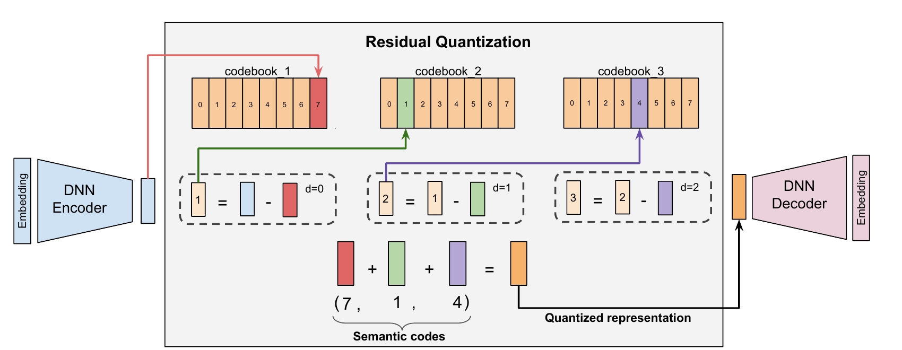

+++
date = '2026-07-09T10:00:00-07:00'
draft = false
title = 'TIGER（生成式推荐的经典论文）: 解释和思考'
summary = """
  *用 RQ-VAE 给每个 item 生成 Semantic ID，再用自回归解码用户的 Semantic ID 序列来做召回。*
"""
+++

*用 RQ-VAE 给每个 item 生成 Semantic ID，再用自回归解码用户的 Semantic ID 序列来做召回。*

论文：**[Recommender Systems with Generative Retrieval](https://arxiv.org/abs/2305.05065)**（Rajput et al., NeurIPS 2023）

---

## TL;DR

传统推荐系统的召回（Retrieval）阶段，把 user 和 item 用 Two-Tower 神经网络嵌到同一个语义空间，再靠 ANN（Approximate Nearest Neighbor）检索出候选。**TIGER**（*Transformer Index for GEnerative Recommenders*）新思路：给每个 item 一个 **Semantic ID**（一个短短的 codeword 元组），把用户和 item 的交互历史（User Sequence）建模成这些 ID 组成的序列，然后训练一个 seq2seq Transformer 模型去**生成**下一个 item 的 Semantic ID。

**召回，就此变成了 next-Semantic-ID 预测**——和 LLM 的 next-token 预测如出一辙。这也就意味着，LLM 那套建模方法和 **Scaling Law** 策略，有机会搬到生成式推荐系统上来。

## 问题在哪

**推荐系统里的召回。** 工业级推荐系统通常分两段跑：

- **召回（Retrieval / candidate generation）：** 从全量 item 里飞快地筛出几百上千个用户可能喜欢的候选。
- **排序（Ranking）：** 上一个更重、更准的模型，给这些候选打分排序，产出最终列表。

```
                    ┌──────────────────────┐
   Item 全库    ──► │   召回（快）         │ ──► 几百个 ──► ┌──────────────────┐
  （百万～十亿）    │  candidate generation│      候选      │  排序（重）      │ ──► 最终
                    └──────────────────────┘                └──────────────────┘     top-N
```

TIGER 针对的是**召回**这一段，任务是 *sequential recommendation*（序列推荐）：给定用户按时间排好的交互历史 `[item_1, …, item_n]`，返回最可能是 `item_{n+1}` 的 top-K 候选。

**传统解法：Two-Tower embedding + ANN 检索**

*Two-Tower* 模型有两座塔（两个神经网络），一座给 user，一座给 item。每座塔把自己那侧的特征编码成一个 embedding，落在**同一个共享空间**里，匹配分数就是两个 embedding 的点积（cosine 相似度）。训练目标是让真实发生过交互的 user–item 得分高。

```
                       匹配分数 = sim(user_emb, item_emb)
                                          ▲
                        ┌─────────────────┴─────────────────┐
                        │              点积                 │
                        └─────────────────┬─────────────────┘
                 user_emb                 │                 item_emb
                    ▲                     │                    ▲
              ┌───────────┐                            ┌───────────┐
              │ User Tower│      （共享 embedding      │ Item Tower│
              │   (MLP)   │           空间）           │   (MLP)   │
              └───────────┘                            └───────────┘
                    ▲                                        ▲
             user 特征：                              item 特征：
        历史 item ID 序列、                       item ID、类目、
        user ID / 画像、上下文                    品牌、文本、价格 …
```

线上服务时，两座塔是拆开用的：所有 **item** embedding 离线算好，灌进 ANN Index；**user** embedding 实时算出来，拿去查这个 Index，取最近邻的那些 item。

```
用户历史 ─► [ User Tower ] ─► user emb ─► 查 ANN Index ─► top-K 最近邻 item
                                          （基于全量 item emb
                                            预先建好）
```

两个痛点：

- **Item ID 是随机的、没有语义。** ID 空间可能极其巨大（比如 Amazon 是十亿量级），这让 embedding 模型很难训练。工程上一般要靠 hash 分桶来压缩 ID 空间，于是又要在模型精度和模型大小之间做权衡。

- **冷启动问题。** 新 item 的 embedding 是随机初始化的，在它积累够用户交互之前，很难被召回。

## TIGER 方法详解

TIGER 对召回换了条路，分两个阶段。**Stage 1** 把每个 item 变成一个 **Semantic ID**——一个有层次结构的 codeword 元组，相似的 item 会共享前缀。**Stage 2** 训一个 seq2seq Transformer，从用户历史生成下一个 item 的 Semantic ID。

### Stage 1 —— 内容 embedding → Semantic ID（靠 RQ-VAE）

把 item 的文本特征（标题、品牌、类目、价格、描述）拼起来，过一遍冻结的 **Sentence-T5** encoder，得到一个 768 维 embedding，再用 **RQ-VAE**（Residual-Quantized VAE）对它做 quantization。RQ-VAE 本质是个 autoencoder，它的 bottleneck 是一摞 vector quantizer——每个层级一个——共同产出 Semantic ID：



*RQ-VAE 架构（[论文](https://arxiv.org/abs/2305.05065) Figure 3）。*

拿一个 item 走一遍。**DNN encoder** 把它的 embedding 映射成 latent `r0 = [0.90, 0.60]`（真实 latent 是 32 维，这里用 2 维是为了数字看得清）。接着 **residual quantizer** 一层一层来，每层挑出最近的那个 codebook 向量（`c_d = argmin_i ‖r_d − C_d[i]‖`），把剩下的残差（`r_{d+1} = r_d − C_d[c_d]`）交给下一层：

```
Level 0（粗）： C0 里最近的是 index 7， C0[7] = [0.80, 0.50]   → c0 = 7
                r1 = r0 − C0[7] = [0.10, 0.10]
Level 1（细）： C1 里最近的是 index 1， C1[1] = [0.12, 0.08]   → c1 = 1
                r2 = r1 − C1[1] = [-0.02, 0.02]
Level 2（细）： C2 里最近的是 index 4， C2[4] = [-0.02, 0.02]  → c2 = 4
                r3 = r2 − C2[4] ≈ [0, 0]
```

挑出来的这几个 index 就是 **Semantic ID =（7, 1, 4）**。把选中的 codeword 向量加起来，就得到 quantization 之后的表示，它能重建出原来的 latent——`C0[7] + C1[1] + C2[4] = [0.90, 0.60] = r0`——**DNN decoder** 再把它映射回 item embedding。

图里为了好懂，用的是 size 为 8 的迷你 codebook；论文里每个 codebook 有 **256** 个 entry。此外还会**再拼上第 4 个 codeword**，用来区分那些前三位恰好撞车的 item。所以每个 item 最终是一个**长度为 4 的元组**——这也是为什么 Stage 2 里，一个 item 就是 4 个 token。

#### 训练 RQ-VAE：三个 Loss

encoder、decoder 和所有 codebook 是联合训练的。麻烦在于：挑最近的 codeword（`argmin`）这一步**不可导**，梯度没法正常穿过去。RQ-VAE 的办法是用 *straight-through estimator*（直通估计），配上一个三段式的 loss（对每一层 `d` 求和）：

```
L = ‖x − x̂‖²  +  Σ_d ( ‖sg[r_d] − e_cd‖²  +  β·‖r_d − sg[e_cd]‖² )
     └ 重建 ┘         └   codebook loss  ┘    └  commitment loss ┘

sg[·] = stop-gradient（反向传播时当常数）；e_cd = 第 d 层选中的 codeword
```

1. **Reconstruction loss（重建损失）** `‖x − x̂‖²` —— 把 decoder 的输出 `x̂` 往原始 embedding `x` 上拉。这个 loss 让模型尽量减小 RQ-VAE quantization 带来的信息损失。

2. **Codebook loss** `‖sg[r_d] − e_cd‖²` —— 把选中的 *codeword* 往它该代表的那个残差上挪。stop-gradient 把残差冻住，所以只有 codebook 向量在动——真正学出 codebook 的，就是这一项。

3. **Commitment loss** `β·‖r_d − sg[e_cd]‖²` —— 反过来，把 *encoder* 产出的残差往选中的 codeword 上挪（这次 stop-gradient 加在 codeword 上，所以只有 encoder 在动）。`β = 0.25` 是 Codebook Loss 和 Commitment Loss 之间的权衡系数。

### Stage 2 —— 用 seq2seq Transformer 做生成式召回

现在每个 item 是 4 个 token，词表大小是 `256 × 4 = 1024` 个语义 token。把用户历史摊平成一条 token 序列，喂给一个 **encoder–decoder Transformer**，让它自回归地生成下一个 item 的 4 个 codeword：

```
  用户历史（item 1..n，每个 = 4 个 codeword，摊平）
 ┌──────────────────────────────────────────────────────────┐
 │ (c0,c1,c2,c3)_1  (c0,c1,c2,c3)_2  ...  (c0,c1,c2,c3)_n   │  输入 token 序列
 └───────────────────────────┬──────────────────────────────┘
                             ▼
                  ┌─────────────────────┐
                  │ Transformer Encoder │
                  └──────────┬──────────┘
                             │ 编码后的上下文
                             ▼
                  ┌─────────────────────┐   一次预测一个 codeword，
       <BOS> ───► │ Transformer Decoder │ ─► 再把它喂回去：c0 ─► c1 ─► c2 ─► c3
                  └─────────────────────┘              └─ 下一个 item 的 Semantic ID ─┘
                             │
                             ▼
      beam search ─► top-K Semantic ID ─► 查表 ─► top-K item
```

Decoder 先预测 `c0`，把它喂回去预测 `c1`，依此类推——和 LLM 生成 token 一模一样，只不过这里的"token"是 codeword，而一整个 item 不过就是 4 个。线上服务时用 **beam search** 拿到 top-K 个最可能的 Semantic ID，再通过查表映射回 item。**召回 = Decoder 生成。**

## 实验与结果

在 Amazon Review 数据集的三个类目（Beauty、Sports、Toys）上评测——序列推荐的标准 benchmark——指标是 Recall@K 和 NDCG@K。

结论概括起来就一句：**TIGER 在三个数据集、两个指标上全面胜出**，最大的提升出现在 Beauty 上，**NDCG@5 比 SASRec 高约 +29%**，**Recall@5 比 S³-Rec 高约 +17%**。不过比具体数字更值得关注的是两点：

- **真正起作用的是 ID 的生成方式。** RQ-VAE 生成的 Semantic ID，明显优于基于 LSH（Locality Sensitive Hash）的 Semantic ID。
- **冷启动和推荐多样性都变好了。** 新 item 可以借助与老 item 共享的 ID 前缀被召回；而基于 temperature 的解码，则能用一点精度换来更多样的推荐。

还有个有意思的发现：解码时会以一个小得出乎意料的概率吐出**非法 Semantic ID**（映射不到任何 item），top-10 场景下大概只有 0.1%–1.6%。加大 beam size（多召回一些候选）就能解决，凑够合法的 top-K。

## 我的一些想法

### TIGER 和 Semantic ID 的好处

* **ID 词表空间极小**

  论文里，长度为 4、每个 codebook 256 个 entry 的 Semantic ID，只需要 `4 × 256 = 1024` 个 codeword embedding，却能表示多达 `256⁴ ≈ 43 亿` 个不同的 item。传统的原子 ID 模型则要给每个 item ID 存一个 embedding（百万到十亿量级）——Semantic ID 用大约 1k 个共享 embedding，替掉了那张巨大的表（其实际体积还得靠 hash 分桶压缩），基本上解决了"ID 空间过大"的问题。

* **Item ID 有语义，而且有层次**

  这对召回的多样性有帮助：可以在不同的层级上，用不同 temperature 做采样。

* **改善冷启动**

  新 item 可以跟着 Semantic ID 相近的老 item 一起被召回。注意这里有个隐含前提：Semantic ID 必须是对***基于内容的***（而非基于交互的）embedding 跑 RQ-VAE 得到的。

* **打开了 LLM 式 Scaling 的大门**

  最重要的一点：它把**召回**问题重构成了 seq2seq 的 **Next ID** 预测问题，和 LLM 的 **Next Token** 预测同构——那么"Scaling Law"那套建模策略带来的收益，也就有机会在这里复现。

### TIGER 的短板

* **基础设施成本**

  传统的 Two-Tower embedding 召回，线上只需要跑一次 User Tower 推理，再做一次 ANN 检索；效率极高，轻松扩到十亿级 item 库。相比之下，TIGER 要做自回归解码 + beam search，推理开销可能大得多。

* **复杂度**

  TIGER 多引入了 RQ-VAE 的模型训练，以及一整套 Semantic ID 的生成流程。如果一个推荐系统本身已经在大量使用基于内容的 embedding 和层次化特征（比如类目），那 TIGER 的增量收益会明显变小，可能撑不起它带来的额外复杂度。

* **召回天然是多路的**

  实践中，召回是个多通道的活儿，候选来自很多条不同的链路。比如 Amazon 的推荐，可以从用户的历史订单、浏览记录、热门 / 趋势商品、折扣商品、新品……等等多个通道里捞候选。指望用 TIGER 一把替掉所有通道，并不现实。更实际的做法，是把 TIGER 当作众多召回通道中的**一路**，尤其用来召回新品、改善冷启动。

### 更大的图景

* **这篇论文为什么重要**

  它是最早把生成式召回真正做到有竞争力的论文之一，也是第一个用**学出来的、带语义的** item ID 去替代随机原子 ID 的工作。这一步重新定义了召回——召回即 next-token 生成——顺带还改善了冷启动。

* **行业趋势**

  Semantic ID 是那一层 tokenization，它让生成式模型得以在 item 上做推理。"item 即 token、召回即生成"这个方向，为把 LLM 的建模方法和 **Scaling Law** 策略搬进推荐系统打开了大门，这显然是整个行业正在奔去的地方。随着推理成本一天比一天低，把推荐模型和推荐系统 scale up，就是未来。

---

#ai #推荐系统 #generativeretrieval #semanticid #rqvae #llm #人工智能 #ai学习 #大模型

If you like this post, consider star [the repo](https://github.com/sleepingbear-ai/sleepingbear-ai.github.io).
