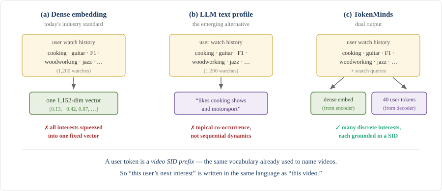
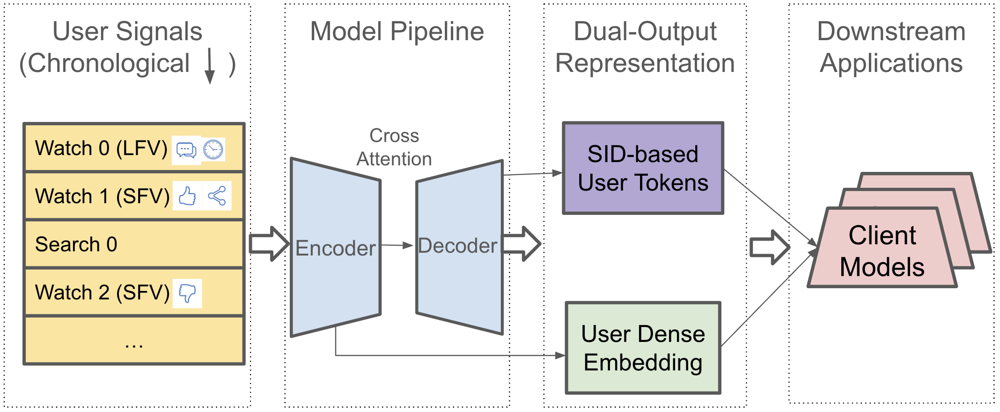
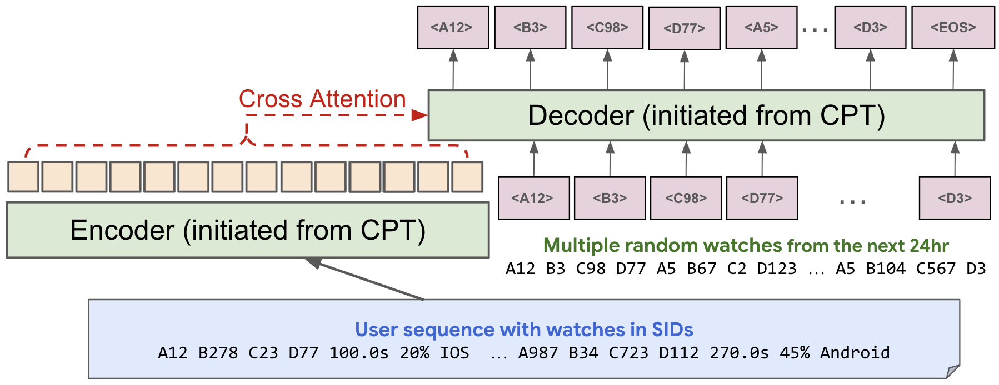
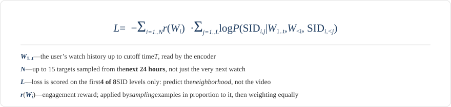
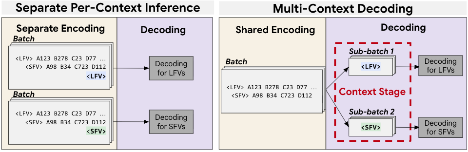
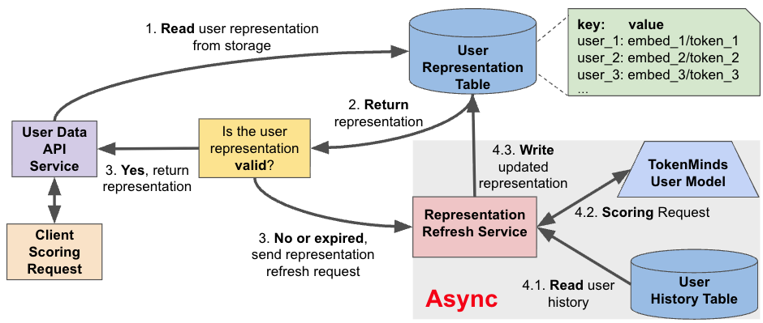

+++
date = '2026-08-14T10:00:00-07:00'
draft = false
title = 'TokenMinds 解释和思考：面向 YouTube 推荐的 LLM 用户建模'
tags = ['ai', '推荐系统', '生成式推荐', '用户建模', 'tokenminds', 'semanticid', 'llm', 'gemini', 'youtube', '人工智能', 'ai学习', '大模型']
summary = """
  *TokenMinds（Google DeepMind & YouTube）用一个基于 Gemini LLM 的 encoder-decoder 同时生成用户 embedding 和 40 个离散 user token，把长视频与短视频的用户建模统一到一个模型里，并通过异步生成和 Cache 服务数十亿用户。它把 YouTube PLUM 的生成式推荐框架从召回推进到了 user modeling。*
"""
+++

*TokenMinds（Google DeepMind & YouTube）用一个基于 Gemini LLM 的 encoder-decoder 同时生成用户 embedding 和 40 个离散 user token，把长视频与短视频的用户建模统一到一个模型里，并通过异步生成和 Cache 服务数十亿用户。它把 YouTube PLUM 的生成式推荐框架从召回推进到了 user modeling。*

论文：**[TokenMinds: Pretrained User Tokens and Embeddings for User Understanding in Large Recommender Systems](https://arxiv.org/abs/2606.25147)**（Liu et al., Google DeepMind & YouTube, 2026 年 6 月）

---

## TL;DR

生成式推荐先给每个 item 分配一个 **Semantic ID（SID）**，再用自回归模型把推荐变成 **Next SID Prediction**。[TIGER](../tiger-generative-retrieval/) 开创了这个方向，[PLUM](../plum/) 则把 Gemini LLM 改造成了 YouTube 的线上生成式召回模型。

TokenMinds 接着问了一个很自然的问题：**既然视频可以有 Semantic ID，用户能不能也用 Semantic ID 表示？**

它的答案是一个已经部署到 YouTube 全量流量的 LLM 用户建模系统：

1. **双重输出**：一个从 PLUM 预训练 LLM warm-start 的 encoder-decoder 读取用户行为。Encoder 生成一个 1,152 维 dense user embedding；decoder 用 beam search 生成 **40 个基于 SID 的离散 user token**。两者都作为特征交给下游排序模型。
2. **一个模型统一两个场景**：用 `<LFV>` / `<SFV>` token 区分长视频和 Shorts，只做一次共享 encoder 计算，再分别 decode 两组 user token，节省 **50% 训练算力和 31% serving 算力**。
3. **异步服务**：每 24 小时离线更新一次用户表示并写入缓存。线上每秒读取 **144 万次**，cache hit rate 达到 **96.4%**；miss 时再异步触发生成。

最有说服力的是线上结果。在 YouTube Shorts 上，单独加入 embedding 带来 `+0.05%` 满意互动，单独加入 token 是 `+0.40%`，**两者一起则达到 `+0.62%`**。这说明 user token 和 user embedding 不是重复的表示，而是可以互补。

## 问题在哪：怎么表示一个用户？

用户建模（User Modeling）是推荐系统的基础模块：

* **输入**：用户看过的长视频和 Shorts、搜索词、点赞和点踩、观看时长等行为序列。
* **输出**：一个能被下游召回或排序模型使用的用户表示。

传统方法通常把整段历史压缩成一个 **dense user embedding**。这种表示简单好用，但有一个结构上的上限：一个人的多种兴趣，最终都要挤进一个固定长度的向量。

另一条近年的路线是让 LLM 生成文字版用户画像，比如“喜欢烹饪节目和赛车”。但论文认为，这类画像更容易捕捉**话题共现**，不擅长行为序列中的动态变化；同时，文字和视频之间仍然存在 **modality gap**。

*TokenMinds 的 user token 是视频 SID 的前缀：用户的“下一类兴趣”和视频使用同一种语言表示。（本图专为本文绘制，基于论文第 1、2 节。）*

**TokenMinds 的核心想法**：直接用视频已经在使用的 SID vocabulary 来表示用户。一个 user token 就是一个视频 SID prefix，因此用户兴趣和候选视频天然处在同一个离散空间里，还继承了 SID 的层级语义。

更重要的是，它没有试图用 token 取代 embedding，而是同时输出两者。

## 方法详解

TokenMinds 沿用了 PLUM 的基础设施：同一个基于多模态视频 embedding 的 RQ-VAE tokenizer，以及把 SID 教给 Gemini LLM 的 Continued Pre-Training（CPT）。如果你对这部分不熟悉，可以先看我的 [PLUM 解读](../plum/)；RQ-VAE 的细节则在 [TIGER 解读](../tiger-generative-retrieval/) 里。

*TokenMinds 整体架构。（[论文](https://arxiv.org/abs/2606.25147) Figure 1，Liu et al., 2026。）*

### 输入：不只是观看历史

TokenMinds 的输入比普通的 watch-history 模型丰富：

* **跨场景观看行为**：长视频（LFV）和 Shorts（SFV）来自多个推荐入口，按时间顺序交错排列。
* **搜索词**：显式表达用户意图。因为 CPT 已经把文本 token 和 SID 放进同一个 vocabulary，最近 **10 条**搜索可以直接用 `<Search>` token 加入序列。
* **互动信号**：每次观看的时长、观看比例、点赞、点踩、设备和时间戳。

每次观看被压缩成一个很小的固定 token budget：

`<LFV|SFV>` + **4 个 SID token** + **1 个 soft token**

前两部分表示视频场景和语义；剩下的非 SID 特征各自 embedding 后拼接，再经过 MLP 投影成一个 soft token。

### 为什么用 encoder-decoder？

这个架构有两个直接好处：

* **Encoder 更适合读完整历史**：双向 attention 能更全面地捕捉长序列模式，对 encoder state 做 pooling 就能得到 user embedding。
* **Serving 时可以拆开**：encoder 很重，负责压缩最多 1,200 次观看的慢变化历史；decoder 更轻，负责反映近期兴趣。两者分开后，可以低频更新 encoder、高频更新 decoder。

### 训练：不只预测“下一个视频”

*Encoder 读历史，decoder 一次生成多个近期未来的 SID。（[论文](https://arxiv.org/abs/2606.25147) Figure 2，Liu et al., 2026。）*

*TokenMinds 的训练目标（论文 Equation 1，本图专为本文标注）。*

Loss 里的三个设计是整个方法的核心：

* **Look-ahead sampling**：不只预测紧接着的下一次观看，而是从**未来 24 小时**的观看里随机抽最多 `N=15` 个目标。用户模型应该表示一段时间内的多种兴趣，而不是过拟合某一次偶然点击。
* **SID truncation**：完整视频 SID 有 8 层，训练时只保留前 **4 层**。一个短前缀代表视频库里的一个语义区域，而不是某一个具体视频，所以更能表达“兴趣”，也减少记忆训练 item 的倾向。这是 ablation 中最重要的设计。
* **一次预测多个目标**：同一个历史序列提供多个监督信号，训练的 sample efficiency 更高。

### Cross-scenario：一个模型同时理解长视频和 Shorts

长视频和 Shorts 的消费方式明显不同，工业系统通常为它们训练两个用户模型。但论文指出：接近一半用户会同时使用两种形式，而且两者 SID 前两层的 vocabulary 有约 **40% 重叠**。用户兴趣并不会按视频形式彻底分开。

TokenMinds 只需在每次观看前加 `<LFV>` 或 `<SFV>`，就能把两类行为按时间统一输入同一个模型。Condition token 不参与 loss——预测它们太简单，反而会降低模型质量。

*Multi-context decoding：一次 encode，按场景并行 decode。（[论文](https://arxiv.org/abs/2606.25147) Figure 3，Liu et al., 2026。）*

线上仍然需要分别输出 LFV 和 SFV 的 user token。朴素方案要把同一段历史 encode 两遍；TokenMinds 的 **multi-context decoding** 只 encode 一遍，再分成两个共享 hidden states 的 decoder sub-batch。结果是训练算力减半，serving 从 698 块芯片降到 481 块，节省 **31%**。

### 下游模型怎么使用离散 user token？

大多数下游模型仍然希望收到 embedding。论文测试了三种 token-to-embedding 方法：

1. **Prefix Embedding Mapping（EM）**：找出具有相同 SID prefix 的视频，对它们原始 content embedding 求平均。
2. **N-gram Embedding**：把 SID prefix 切成固定长度 sub-word，查询可学习的 embedding 后相加。
3. **SPM Embedding**：用 SentencePiece 学习可变长度 sub-word，再查询 embedding。

后两种统称 **Learnable Embeddings（LE）**。每个用户的 40 个 token 分别被 embedding，再 pooling 成一个用户向量。Shorts 线上实验中，LE 带来 `+0.22%` 满意互动，而静态 EM 是 `−0.02%`：让下游模型自己学习 token embedding 更有效。

### Serving：缓存 + 异步更新

*TokenMinds 的 serving 架构。（[论文](https://arxiv.org/abs/2606.25147) Figure 4，Liu et al., 2026。）*

要让生成式模型服务数十亿用户，关键不是让它同步响应每一次排序请求，而是**把生成成本摊到后续许多次使用上**。TokenMinds 每 24 小时在后台生成用户表示并写入 key-value store；线上模型直接读缓存，缺失或过期时再异步刷新。

生产环境达到 **144 万次读取/秒、96.4% cache hit rate**。存储上，每个用户的 token 表示占 **1,280 bytes**，dense embedding 则占 **4,608 bytes**。

## 实验与结果

线上模型基于 **Gemini-1.5 LLM**：370M MoE encoder + 370M dense decoder，都从 PLUM 的 CPT checkpoint 初始化。模型每天用最新数据持续训练，只需要每天数百万条样本；相比之下，基于 Large Embedding Model（LEM）的模型通常需要数十亿次 interaction。

**训练 ablation**（指标为 SID prefix 的 Recall@10）：

| 模型 | Session Recall | Cold-Start Recall |
|:---|:---:|:---:|
| **TokenMinds（完整）** | **0.291** | **0.210** |
| − Multiple Targets | 0.265（−8.9%） | 0.203（−3.3%） |
| − Look-ahead Window | 0.278（−4.5%） | 0.189（−10.0%） |
| − SID Truncation | 0.247（−15.1%） | 0.174（−17.1%） |

*[论文](https://arxiv.org/abs/2606.25147) Table 1。Session Recall 预测当前 session 最后一次观看；Cold-Start Recall 从截短历史预测随机的未来观看。*

在 Cold-Start 上，去掉 Look-ahead Window 损失 10%，去掉 SID truncation 损失 17.1%。这说明：预测更远、更广的兴趣，以及用粗粒度 SID 表示兴趣，对泛化尤其重要。

**LLM 初始化和搜索词的作用**（相对“随机初始化、无搜索词”baseline 的 Recall@10 提升）：

| 初始化方式 | 加入搜索词 | Session | Cold-Start |
|:---|:---:|:---:|:---:|
| Pre-Trained | 否 | +3.3% | +5.7% |
| CPT | 否 | +5.3% | +8.7% |
| Random | 是 | +12.5% | +16.9% |
| Pre-Trained | 是 | +18.5% | +25.1% |
| **CPT** | **是** | **+23.5%** | **+31.5%** |

*[论文](https://arxiv.org/abs/2606.25147) Table 2。*

这里有两个结论：

* `CPT > 通用预训练 Gemini > 随机初始化`：通用 LLM 知识有帮助，而把 SID 和文本对齐的 CPT 还能进一步提升。
* 搜索词本身对 Cold-Start 就有 `+16.9%`；CPT + 搜索词达到 `+31.5%`。已经理解 SID 的 LLM，更能把文字表达的显式意图和视频观看历史结合起来。

**最重要的线上 A/B 结果**（在生产排序模型上运行 7 天）：

| 场景 | 用户表示 | Engaged Users | Satisfied Engagement |
|:---|:---|:---:|:---:|
| | Embed-only | 0.00% | +0.05% |
| **Shorts（SFV）** | Token-only | +0.04% | **+0.40%** |
| | Embed + Token | **+0.11%** | **+0.62%** |
| | Embed-only | **+0.04%** | +0.03% |
| **长视频（LFV）** | Token-only | +0.01% | +0.04% |
| | Embed + Token | **+0.02%** | **+0.08%** |

*[论文](https://arxiv.org/abs/2606.25147) Table 4。粗体表示在 95% 置信水平下显著。*

Shorts 上，embedding 和 token 一起使用的 `+0.62%`，甚至高于两者单独提升之和。这是论文最重要的结果：**dense embedding 更像是对历史的压缩，user token 更像是对未来兴趣的多路预测；它们是互补的。**

## 我的一些想法

### 优势与启发

* **把 Semantic ID 从 item 扩展到 user**：TIGER、OneRec 和 PLUM 证明了 SID 作为 item 表示的价值；TokenMinds 则第一次在 YouTube 量级验证了 SID-based user token。
* **用粗粒度 item token 表示用户兴趣**：8 层 item SID 是空间里的一个“点”，4 层 user token 是一个“区域”。用户和 item 使用同一套 vocabulary，但处于不同粒度。Cold-Start ablation 的 `−17.1%` 说明这个简单设计非常有效。
* **异步 serving 才是真正的 scale-up 关键**：一个昂贵的用户表示只生成一次，却能被许多下游模型重复使用。缓存和异步刷新让 LLM 用户建模在工业规模下变得可行。
* **Token 化让跨场景统一变简单**：在共享 SID 空间里，合并长视频和 Shorts 只需要两个 condition token；一个模型就能替代两个模型。

### 不足与可能的后续工作

* **长视频上的收益较弱**：LFV 的满意互动只提升 `+0.08%`，明显小于 Shorts 的 `+0.62%`。这套方法可能更适合快速连续消费、反馈密集的场景。
* **24 小时更新一次可能太慢**：尤其在 Shorts 中，兴趣可能在一个 session 内就快速变化。论文的 encoder-decoder 拆分本来就允许“重 encoder 慢更新、轻 decoder 快更新”，后续很值得真正利用这个能力。
* **Learnable Embedding 增加了一层复杂度**：SID prefix 本身已经有层级语义，下游却仍然要通过 N-gram 或 SentencePiece 重新学习 embedding。如何更直接地利用 SID 结构，仍有优化空间。

### 大方向

**为什么这篇论文重要**：生成式推荐此前主要关注如何把 item 变成 Semantic ID。TokenMinds 证明了**用户也可以被 token 化**，而且多个 user token 确实能表达一个用户的多种兴趣。

它也提醒我们，token 不一定要取代 embedding。Token 更适合表示离散、多样、面向未来的兴趣，embedding 更适合连续、紧凑地总结历史；两者结合可能才是更完整的用户表示。

把几篇工作连起来看，会形成一条很清楚的路线：**[TIGER](../tiger-generative-retrieval/) → [PLUM](../plum/) → TokenMinds**——先把 item 变成语义 token，再教 LLM 理解这些 token，最后用同一种 token 语言表示用户。随着 LLM inference 继续变便宜，推荐系统里的下一波创新，很可能不只是“用 LLM 排序”，而是把用户、内容和行为都统一成可生成、可组合的 token。

## 参考文献

1. Liu et al. **[TokenMinds: Pretrained User Tokens and Embeddings for User Understanding in Large Recommender Systems](https://arxiv.org/abs/2606.25147)**. Google DeepMind & YouTube, 2026 年 6 月。
2. He et al. **[PLUM: Adapting Pre-trained Language Models for Industrial-scale Generative Recommendations](https://arxiv.org/abs/2510.07784)**. Google DeepMind & YouTube, 2025 年 10 月。— [我的解读](../plum/)
3. Rajput et al. **[Recommender Systems with Generative Retrieval (TIGER)](https://arxiv.org/abs/2305.05065)**. NeurIPS 2023。— [我的解读](../tiger-generative-retrieval/)
4. Deng et al. **[OneRec: Unifying Retrieve and Rank with Generative Recommender and Preference Alignment](https://arxiv.org/abs/2502.18965)**. Kuaishou, 2025。— [我的解读](../onerec/)

---

#ai #推荐系统 #生成式推荐 #用户建模 #tokenminds #semanticid #llm #gemini #youtube #人工智能 #ai学习 #大模型

如果你觉得本文有帮助，欢迎[点赞关注](https://www.rednote.com/user/profile/61d67d89000000001000c76b)支持！

If you like this post, consider star [the repo](https://github.com/sleepingbear-ai/sleepingbear-ai.github.io).
